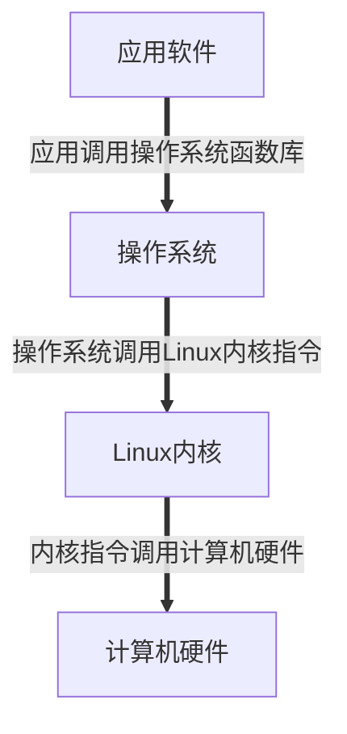
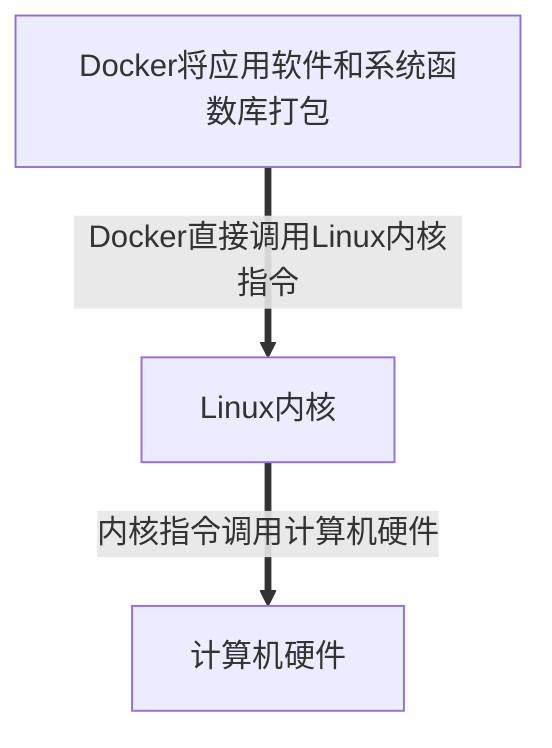

# 概述

docker是一个快速交付应用、运行应用的技术

软件的运行流程：



Docker的执行流程：



# Docker与虚拟机的区别


# 镜像和容器

镜像(Image)：Docker将应用程序及其所需的依赖、函数库、环境、配置等文件打包在一起，称为镜像

容器(Container):镜像中的应用程序运行后形成的进程就是容器

# DockerHub

Docker镜像托管平台

# Docker架构

- 服务端(server):Docker守护进程，负责处理Docker指令，管理镜像、容器等
- 客户端(client):通过命令或RestAPIl向Docker服务端发送指令。可以在本地或远程向服务端发送指令。


# Docker安装

## centos安装docker

- 卸载之前旧版本docker

```shell
yum remove docker \
                  docker-client \
                  docker-client-latest \
                  docker-common \
                  docker-latest \
                  docker-latest-logrotate \
                  docker-logrotate \
                  docker-selinux \
                  docker-engine-selinux \
                  docker-engine \
                  docker-ce
```

- 安装yum工具

```shell
yum install -y yum-utils \
           device-mapper-persistent-data \
           lvm2 --skip-broken
```

- 更新本地镜像源

```shell
# 设置docker镜像源
yum-config-manager \
    --add-repo \
    https://mirrors.aliyun.com/docker-ce/linux/centos/docker-ce.repo
    
sed -i 's/download.docker.com/mirrors.aliyun.com\/docker-ce/g' /etc/yum.repos.d/docker-ce.repo

yum makecache fast
```

- 安装docker社区版

```shell
yum install -y docker-ce
```

# 启动Docker

## 关闭防火墙或配置防火墙端口

```sh
# 关闭
systemctl stop firewalld
# 禁止开机启动防火墙
systemctl disable firewalld
```

## 启动Docker

```shell
systemctl start docker  # 启动docker服务

systemctl stop docker  # 停止docker服务

systemctl restart docker  # 重启docker服务
```

## 阿里云镜像加速

```shell
sudo mkdir -p /etc/docker
sudo tee /etc/docker/daemon.json <<-'EOF'
{
  "registry-mirrors": ["https://oagsu5t7.mirror.aliyuncs.com"]
}
EOF
sudo systemctl daemon-reload
sudo systemctl restart docker
```

# 镜像命令

## 概述


## 本地构建镜像

## 从服务器拉取镜像

```shell
# 拉取nginx镜像
docker pull 镜像名:版本
```

## 查看镜像

```shell
docker images
```

## 导出镜像

```shell
docker save -o 导出文件名 镜像名:版本
```

## 导入镜像

```shell
docker load -i 导入文件名
```

## 删除镜像

```shell
docker rmi 镜像名:版本
```

# 容器命令

## 概述


## 创建并运行容器

- `docker run`:创建并运行一个容器
- `--name`:给容器起一个名字，比如叫做mn
- `-v`: 目录挂载
  - 数据卷挂载：如果数据卷不存在，会自动创建数据卷
  - 宿主机目录挂载
  - 宿主机文件挂载
- `-p`：将宿主机端口与容器端口映射，冒号左侧是宿主机端口，右侧是容器端口
- `-d`:后台运行容器
- `镜像名称`:例如nginx

```shell
docker run --name 容器名称 -v 容器外目录:容器内路径 -p 外部端口:内部端口 -d 镜像名称
```

## 停止容器

```shell
docker stop 容器名称
```

## 启动容器

```shell
docker start 容器名称
```

## 删除容器

```shell
# 容器必须停止后才能删除
docker rm 容器名称
# 强制删除运行中的容器
docker rm -f 容器名称
```

## 查看所有容器状态

```shell
# 查看启动着的容器
docker ps
# 查看所有容器(包含停止的容器)
docker ps -a
```

## 查看容器日志

- `-f`:持续跟踪日志

```shell
docker logs 容器名 -f
```

## 进入容器

- 进入容器

```shell
docker exec -it 容器名 bash
```

- 因为容器中没有vim，进入指定指定目录，通过`sed`命令修改文件

## 退出容器

```shell
exit
```

# 数据卷

## 概述

`数据卷(volume)`:是一个虚拟目录，指向宿主机文件系统中的某个目录。

容器和容器中的数据是耦合的，存在以下问题：
- 不便于修改，修改容器内容需要进入容器内部
- 容器内的数据对外是不可见的，多个容器不可复用同一份数据
- 删除容器，其中的数据也会被彻底删除，这种操作很危险

## 创建数据卷

```shell
docker volume create 数据卷名称
```

## 查看所有数据卷

```shell
docker volume ls
```

## 查看数据卷详情

```shell
docker volume inspect 数据卷名称
```

## 删除所有未使用的卷

```shell
docker volume prune
```

## 删除指定卷

```shell
docker volume rm 数据卷名称
```

# 自定义镜像

`Dockerfile`就是一个文本文件，其中包含一个个的指令(Instruction),用指令来说明要执行什么操作来构建镜像。每一个指令都会形成一层Layer。

```dockerfile

```
