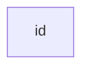
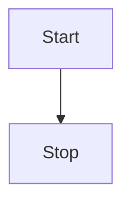

# 简介

它是一种基于 Javascript 的图表和图表工具，动态将markdown转化为图表

[文档](https://mermaid-js.github.io/mermaid/#/)

[在线编辑器](https://mermaid.live/edit#eyJjb2RlIjoiZ3JhcGggVERcbiAgICBBW0NocmlzdG1hc10gLS0-fEdldCBtb25leXwgQihHbyBzaG9wcGluZylcbiAgICBCIC0tPiBDe0xldCBtZSB0aGlua31cbiAgICBDIC0tPnxPbmV8IERbTGFwdG9wXVxuICAgIEMgLS0-fFR3b3wgRVtpUGhvbmVdXG4gICAgQyAtLT58VGhyZWV8IEZbZmE6ZmEtY2FyIENhcl1cbiAgIiwibWVybWFpZCI6IntcbiAgXCJ0aGVtZVwiOiBcImRhcmtcIlxufSIsInVwZGF0ZUVkaXRvciI6dHJ1ZSwiYXV0b1N5bmMiOnRydWUsInVwZGF0ZURpYWdyYW0iOnRydWV9)

# 配置


# 图表语法

## 流程图

### 默认节点

```
flowchart LR
    id
```



### 带文本的节点

```plaintext
flowchart LR
    id1[This is the text in the box]
```


### 图表方向

- 上下方向

```
flowchart TD
    Start --> Stop
```



- 左右方向

```
flowchart LR
    Start --> Stop
```

