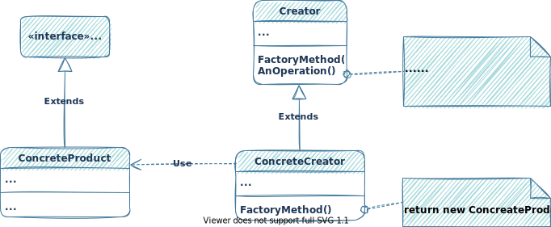

# 概述

参考网站：[设计模式](https://refactoringguru.cn/design-patterns)

书籍推荐： [设计模式 : 可复用面向对象软件的基础](https://book.douban.com/subject/1052241/)

书籍推荐：[Head First 设计模式（中文版）](https://book.douban.com/subject/2243615/)

⭐设计模式是建立在`面向对象`的基础之上的，如果对面向对象相关知识不是很了解，
可以参考：[面向对象](/general/object-oriented-analysis/index.html)部分

# 设计原则

优秀设计的特性：
- 代码复用
- 拓展性

## 封装变化的内容

找到程序中变化的内容将其与不变的内容分开

`目的`：将变化造成的影响最小化

## 面向接口进行开发，而不是面向实现

依赖于抽象类型，而不是具体类

## 组合或聚合优于继承

继承存在的问题：
- 子类不能减少超类的接口
- 在重写方法时，需要确保新行为与基类中的版本兼容
- 继承打破了超类的封装
- 子类与超累紧密耦合
- 通过继承复用代码可能导致平行继承体系的产生

继承代表`是`关系：汽车`是`交通工具
组合表示`有`关系：汽车`有`一个引擎

## 单一职责原则

尽量让每个类只负责软件中的一个功能，并将该功能完全封装（你也可称之为隐藏）在该类中。

## 开闭原则

对于扩展，类应该是“开放”的；对于修改，类则应是“封闭”的。实现新功能时保持已有代码不变。

## 里氏替换原则

当你扩展一个类时，记住你应该要能在不修改客户端代码的情况下将子类的对象作为父类对象进行传递。

- 子类方法的参数类型必须与其超类的参数类型相匹配或更加抽象。
- 子类方法的返回值类型必须与超类方法的返回值类型或是其子类别相匹配。
- 子类中的方法不应抛出基础方法预期之外的异常类型。
- 子类不应该加强其前置条件。
- 子类不能削弱其后置条件。
- 超类的不变量必须保留。
- 子类不能修改超类中私有成员变量的值。

## 接口隔离原则

客户端不应被强迫依赖于其不使用的方法。

尽量缩小接口的范围，使得客户端的类不必实现其不需要的行为。


## 依赖倒置原则

高层次的类不应该依赖于低层次的类。 两者都应该依赖于抽象接口。抽象接口不应依赖于具体实现。具体实现应该依赖于抽象接口。

`依赖倒置原则`通常和`开闭原则`共同发挥作用：你无需修改已有类就能用不同的业务逻辑类扩展低层次的类。

# 创建型模式

创建型模式提供了创建对象的机制，能够提升已有代码的灵活性和可复用性

## 工厂方法-Factory Method

### 意图

定义一个用于`创建对象的接口（或抽象方法）`，让子类决定实例化哪一个类。使实例化某个类的操作延续到子类。

### 别名

- 虚构造器
- Virtual Constructor

### 示例说明

- 假设现在有一款物流管理应用（Logistics），目前只能管理卡车运输(Truck)


- 目前，物流管理应用的`planDelivery`方法只与卡车有关.如果添加海上业务，增加`轮船`类。则需要修改`planDelivery`方法代码。
  更糟糕的是。后面可能会出现更多的运输方式，每次增加，都得修改`planDelivery`方法。错误的示范如下：


- 上面的做法，每次增加交通设备都需要修改`planDelivery`方法。`工厂方法`解决了这个问题。
  将new对象的工作交给`工厂方法`。在`子类`中重写`工厂方法`，从而改变创建产品的类型。


### 示例代码实现


- 创建交通工具接口和实现类

```java
public interface Transport {
    /**
     * 运送接口
     */
    public void deliver();
}
```

```java
public class Truck implements Transport{

    /**
     * 运送接口
     */
    @Override
    public void deliver() {
        System.out.println("卡车运送货物");
    }
}
```

```java
public class Ship implements Transport{
    /**
     * 运送接口
     */
    @Override
    public void deliver() {
        System.out.println("轮船运送货物");
    }
}
```

- 创建物流类

```java
public abstract class Logistics {

    /**
     * 进行货物运送
     */
    public void planDeliver() {
        createTransport().deliver();
    }


    /**
     * 工厂方法
     *
     * 抽象方法，由子类实现，返回具体的交通工具
     *
     * @return 交通工具
     */
    public abstract Transport createTransport();
}
```

- 创建物流类子类实现工厂方法

```java
public class RoadLogistics extends Logistics{
    /**
     * @return 交通工具
     */
    @Override
    public Transport createTransport() {
        return new Truck();
    }
}
```

```java
public class SealLogistics extends Logistics{
    /**
     * @return 交通工具
     */
    @Override
    public Transport createTransport() {
        return new Ship();
    }
}
```

- 测试

```java
public class Demo {
    public static void main(String[] args) {
        //陆地物流
        Logistics roadLogistics = new RoadLogistics();
        roadLogistics.planDeliver();

        //海上物流
        Logistics sealLogistics = new SealLogistics();
        sealLogistics.planDeliver();
    }
}
```

### 结构



- 产品（Product）
  - 定义工厂方法所创建对象的接口
- 具体产品（ConcreteProduct）
  - 实现Product接口
- 创建者（Creator）
  - 声明工厂方法，该方法返回一个Product对象
  - 可以调用工厂方法创建一个Product对象
  - 尽管它的名字是创建者，但它最主要的职责并不是创建产品。创建者类包含一些与产品相关的核心业务逻辑。
- 具体创建者(ConcreteCreator)
  - 重定义工厂方法以返回一个ConcreteProduct实例

### 适用场景

- 当你在编写代码的过程中，如果无法预知对象确切类别时。
- 当一个类希望由它的子类来指定它所创建的对象的时候。
- 如果你希望用户能扩展你软件库或框架的内部组件。
- 如果你希望复用现有对象来节省系统资源，而不是每次都重新创建对象，可使用工厂方法。
  - 有一个既能够创建新对象，又可以重用现有对象的方法。

### 优缺点

- 优点
  - 你可以避免创建者和具体产品之间的紧密耦合。
  - `单一职责原则`。你可以将产品创建代码放在程序的单一位置，从而使得代码更容易维护。
  - `开闭原则`。无需更改现有客户端代码，你就可以在程序中引入新的产品类型。
- 缺点
  - 应用工厂方法模式需要引入许多新的子类，代码可能会因此变得更复杂。最好的情况是将该模式引入创建者类的现有层次结构中。

### 注意事项


### 与其它模式的关系

- 在许多设计工作的初期都会使用`工厂方法`（较为简单，而且可以更方便地通过子类进行定制），
随后演化为使用`抽象工厂`、`原型`或`生成器`（更灵活但更加复杂）。
- `抽象工厂`模式通常基于一组`工厂方法`，但你也可以使用`原型模式`来生成这些类的方法。
- 你可以同时使用`工厂方法`和`迭代器`来让子类集合返回不同类型的迭代器，并使得迭代器与集合相匹配。
- `原型`并不基于继承，因此没有继承的缺点。另一方面，原型需要对被复制对象进行复杂的初始化。`工厂方法`基于继承，
但是它不需要初始化步骤。
- `工厂方法`是`模板方法`的一种特殊形式。同时，`工厂方法`可以作为一个大型`模板方法`中的一个步骤。

## 抽象工厂

### 意图

### 别名

### 示例说明

### 示例代码实现

### 结构

### 适用场景

### 优缺点

### 注意事项

### 与其它模式的关系

## 生成器

### 意图

### 别名

### 示例说明

### 示例代码实现

### 结构

### 适用场景

### 优缺点

### 注意事项

### 与其它模式的关系

## 原型

### 意图

### 别名

### 示例说明

### 示例代码实现

### 结构

### 适用场景

### 优缺点

### 注意事项

### 与其它模式的关系

## 单例

### 意图

### 别名

### 示例说明

### 示例代码实现

### 结构

### 适用场景

### 优缺点

### 注意事项

### 与其它模式的关系

# 结构型模式

## 适配器

### 意图

### 别名

### 示例说明

### 示例代码实现

### 结构

### 适用场景

### 优缺点

### 注意事项

### 与其它模式的关系

## 桥接

### 意图

### 别名

### 示例说明

### 示例代码实现

### 结构

### 适用场景

### 优缺点

### 注意事项

### 与其它模式的关系

## 组合

### 意图

### 别名

### 示例说明

### 示例代码实现

### 结构

### 适用场景

### 优缺点

### 注意事项

### 与其它模式的关系

## 装饰

### 意图

### 别名

### 示例说明

### 示例代码实现

### 结构

### 适用场景

### 优缺点

### 注意事项

### 与其它模式的关系

## 外观

### 意图

### 别名

### 示例说明

### 示例代码实现

### 结构

### 适用场景

### 优缺点

### 注意事项

### 与其它模式的关系

## 享元

### 意图

### 别名

### 示例说明

### 示例代码实现

### 结构

### 适用场景

### 优缺点

### 注意事项

### 与其它模式的关系

## 代理

### 意图

### 别名

### 示例说明

### 示例代码实现

### 结构

### 适用场景

### 优缺点

### 注意事项

### 与其它模式的关系

# 行为型模式

## 责任链

### 意图

### 别名

### 示例说明

### 示例代码实现

### 结构

### 适用场景

### 优缺点

### 注意事项

### 与其它模式的关系

## 命令

### 意图

### 别名

### 示例说明

### 示例代码实现

### 结构

### 适用场景

### 优缺点

### 注意事项

### 与其它模式的关系

## 迭代器

### 意图

### 别名

### 示例说明

### 示例代码实现

### 结构

### 适用场景

### 优缺点

### 注意事项

### 与其它模式的关系

## 中介者

### 意图

### 别名

### 示例说明

### 示例代码实现

### 结构

### 适用场景

### 优缺点

### 注意事项

### 与其它模式的关系

## 备忘录

### 意图

### 别名

### 示例说明

### 示例代码实现

### 结构

### 适用场景

### 优缺点

### 注意事项

### 与其它模式的关系

## 观察者

### 意图

### 别名

### 示例说明

### 示例代码实现

### 结构

### 适用场景

### 优缺点

### 注意事项

### 与其它模式的关系

## 状态

### 意图

### 别名

### 示例说明

### 示例代码实现

### 结构

### 适用场景

### 优缺点

### 注意事项

### 与其它模式的关系

## 策略

### 意图

### 别名

### 示例说明

### 示例代码实现

### 结构

### 适用场景

### 优缺点

### 注意事项

### 与其它模式的关系

## 模板方法

### 意图

### 别名

### 示例说明

### 示例代码实现

### 结构

### 适用场景

### 优缺点

### 注意事项

### 与其它模式的关系

## 访问者

### 意图

### 别名

### 示例说明

### 示例代码实现

### 结构

### 适用场景

### 优缺点

### 注意事项

### 与其它模式的关系


