# 概述

参考网站：[设计模式](https://refactoringguru.cn/design-patterns)

书籍推荐： [设计模式 : 可复用面向对象软件的基础](https://book.douban.com/subject/1052241/)

书籍推荐：[Head First 设计模式（中文版）](https://book.douban.com/subject/2243615/)

⭐设计模式是建立在`面向对象`的基础之上的，如果对面向对象相关知识不是很了解，
可以参考：[面向对象](/general/object-oriented-analysis/index.html)部分

# 设计原则

优秀设计的特性：
- 代码复用
- 拓展性

## 封装变化的内容

找到程序中变化的内容将其与不变的内容分开

`目的`：将变化造成的影响最小化

## 面向接口进行开发，而不是面向实现

依赖于抽象类型，而不是具体类

## 组合或聚合优于继承

继承存在的问题：
- 子类不能减少超类的接口
- 在重写方法时，需要确保新行为与基类中的版本兼容
- 继承打破了超类的封装
- 子类与超累紧密耦合
- 通过继承复用代码可能导致平行继承体系的产生

继承代表`是`关系：汽车`是`交通工具
组合表示`有`关系：汽车`有`一个引擎

## 单一职责原则

尽量让每个类只负责软件中的一个功能，并将该功能完全封装（你也可称之为隐藏）在该类中。

## 开闭原则

对于扩展，类应该是“开放”的；对于修改，类则应是“封闭”的。实现新功能时保持已有代码不变。

## 里氏替换原则

当你扩展一个类时，记住你应该要能在不修改客户端代码的情况下将子类的对象作为父类对象进行传递。

- 子类方法的参数类型必须与其超类的参数类型相匹配或更加抽象。
- 子类方法的返回值类型必须与超类方法的返回值类型或是其子类别相匹配。
- 子类中的方法不应抛出基础方法预期之外的异常类型。
- 子类不应该加强其前置条件。
- 子类不能削弱其后置条件。
- 超类的不变量必须保留。
- 子类不能修改超类中私有成员变量的值。

## 接口隔离原则

客户端不应被强迫依赖于其不使用的方法。

尽量缩小接口的范围，使得客户端的类不必实现其不需要的行为。

## 依赖倒置原则

高层次的类不应该依赖于低层次的类。 两者都应该依赖于抽象接口。抽象接口不应依赖于具体实现。具体实现应该依赖于抽象接口。

`依赖倒置原则`通常和`开闭原则`共同发挥作用：你无需修改已有类就能用不同的业务逻辑类扩展低层次的类。

# 创建型模式

创建型模式提供了创建对象的机制，能够提升已有代码的灵活性和可复用性

## 工厂方法

### 意图

定义一个用于`创建对象的接口（或抽象方法）`，让子类决定实例化哪一个类。是实例化某个类的操作延续到子类。

### 别名

- 虚构造器
- 虚拟构造函数

### 示例说明

- 假设现在有一款物流管理应用（Logistics），目前只能管理卡车运输(Truck)

- 目前，物流管理应用的`planDelivery`方法只与卡车有关.如果添加海上业务，增加`轮船`类。则需要修改`planDelivery`方法代码。
  更糟糕的是。后面可能会出现更多的运输方式，每次增加，都得修改`planDelivery`方法。错误的示范如下：

- 上面的做法，每次增加交通设备都需要修改`planDelivery`方法。`工厂方法`解决了这个问题。
  将new对象的工作交给`工厂方法`。在`子类`中重写`工厂方法`，从而改变创建产品的类型。

### 示例代码实现

# 结构型模式

# 行为型模式

## 模板方法模式

### 意图
