本文通过学习刘伟老师的书[《Java设计模式》](https://book.douban.com/subject/30173863/)
和[博客](https://blog.csdn.net/lovelion/article/details/17517213)，以及[设计模式学习网站](https://refactoringguru.cn/design-patterns)
整理。

# 定义

`模式`是在特定环境下人们解决某类重复出现问题的一套成功或有效的解决方案

`设计模式`是在特定环境下为了解决某一通用软件设计问题提供的一套定制的解决方案，该方案
描述了对象和类之间的相互作用。

# 设计模式基本要素

- 模式名称
- 别名
- 模式的分类
  - 模式所属类别
- 模式概述
  - 模式的动机与意图，模式的定义
- 模式结构与实现
  - 描述设计模式的组成成分，以及这些组成成分之间的相互关系、各自的职责和协作方式
- 实例代码
- 模式拓展
  - 该模式的一些改进，与其它模式联用
- 效果
  - 模式优缺点分析
  - 结合设计原则进行分析
- 模式的适用性
  - 什么情况下可以使用该设计模式
- 模式应用
  - 在已有系统中该模式的使用

# 24种模式概要


# 面向对象设计原则

- 衡量软件质量
    - 可维护性（Maintainability）
    - 可复用性（Reusability）

## 单一职责原则

一个对象应该只包含单一的职责，并且该职责被完整地封装在一个类中。

## 开闭原则

软件实体应该对拓展开发，对修改关闭。

软件实体应尽量在 `不修改原有代码`的情况下进行 `拓展`。

## 里氏代换原则

所有引用基类的地方必须能透明地使用其子类的对象。

父类对象可以用子类对象替换，子类对象不能用父类对象替换。

`里氏代换原则`是实现 `开闭原则`的重要方式之一。程序中尽量使用父类类型来对对象进行定义，而在运行时再确定其子类类型，
用子类对象来替代父类对象。

## 依赖倒转原则

高层模块不应该依赖低层模块，它们都应该依赖抽象。抽象不应该依赖于细节，细节应该依赖于抽象。

针对接口编程，不要针对实现编程。换句话说，就是尽量不要使用具体的实现类，而是使用它对应的接口或者所继承的抽象类。

面向接口编程时，具体类需要通过依赖注入（Dependence Injection）的方式注入到对象中，
一般有以下三种注入方式：

- 构造注入：通过构造函数传入具体类的对象
- 设值注入：通过Setter方法传入具体类的对象
- 接口注入：方法在定义时使用的是抽象类型，运行时再传入具体类的对象

## 接口隔离原则

客户端不应该依赖那些它不需要的接口

将大接口中的方法根据职责不同放在不同小接口中，以确保每个接口使用起来都较为方便。

同时接口的粒度也不能太小，否则会导致系统接口泛滥，不利于维护。

## 合成复用原则

优先使用对象组合，而不是通过继承来达到复用的目的。

继承破坏了基类的封装性，将基类的实现细节暴露给了子类。

相比于继承，组合可以使系统更加灵活，降低类与类之间的耦合度。

## 迪米特法则

每一个软件单位对其它单位都只是最少的知识，而且局限于那些与本单位密切相关的软件单位。

不要和 `陌生人`说话，只与你的直接 `朋友`通讯。在迪米特法则中，对于一个对象，其朋友包括以下几类：

- 当前对象本身（this）
- 以参数形式传入到当前对象方法中的对象。
- 当前对象的成员对象
- 如果当前对象的成员对象是一个集合，那么集合中的元素也都是朋友
- 当前对象所创建的对象

## 小结

一般情况下 `开闭原则`，`里氏代换原则`和 `依赖倒置原则`会同时出现，其中：

- 开闭原则是目的
- 里氏代换原则是基础
- 依赖导致原则是手段

# 简单工厂模式（Simple Factory）

## 模式分类

创建型模式

对象模式

## 模式概述

定义一个工厂类，它可以根据参数的不同返回不同类的实例，被创建的实例通常具有共同的父类。

## 模式结构与实现



- Factory(工厂角色)
- Product(抽象产品角色)
- ConcreteProduct(具体产品角色)

## 实例代码

> 某公司需要开发一套图表库，该表标可以为应用系统提供多种不同外观的图表。
> 如柱状图（HistogramChart）、饼状图（PieChart）、折线图（LineChart）等。
> 通过设置不同的参数即可得到不同类型的图表，而且可以较为方便地对图表库进行拓展，以便增加新的图表库。


- 抽象图表接口，充当抽象产品类：

```java
package cn.com.lgs.simple_factory_pattern;

/**
 * 抽象图表接口，充当抽象产品类
 *
 * @author luguosong
 * @date 2022/2/2 9:56
 */
public interface Chart {
    public void display();
}
```

- 柱状图类，充当具体产品类：

```java
package cn.com.lgs.simple_factory_pattern;

/**
 * 柱状图类
 *
 * @author luguosong
 * @date 2022/2/2 9:58
 */
public class HistogramChart implements Chart {

    public HistogramChart() {
        System.out.println("创建柱状图！");
    }

    @Override
    public void display() {
        System.out.println("显示柱状图！");
    }
}
```

- 饼状图类，充当具体产品类：

```java
package cn.com.lgs.simple_factory_pattern;

/**
 * 饼状图类
 *
 * @author luguosong
 * @date 2022/2/2 10:00
 */
public class PieChart implements Chart {

    public PieChart() {
        System.out.println("创建饼状图！");
    }

    @Override
    public void display() {
        System.out.println("显示饼状图！");
    }
}
```

- 折线图类，充当具体产品类：

```java
package cn.com.lgs.simple_factory_pattern;

/**
 * 折线图类
 *
 * @author luguosong
 * @date 2022/2/2 10:02
 */
public class LineChart implements Chart {

    public LineChart() {
        System.out.println("创建折线图！");
    }

    @Override
    public void display() {
        System.out.println("显示折线图！");
    }
}
```

- 图表工厂类，充当工厂类。

```java
package cn.com.lgs.simple_factory_pattern;

/**
 * @author luguosong
 * @date 2022/2/2 10:04
 */
public class ChartFactory {
    public static Chart getChart(String type) {
        Chart chart = null;
        if (type.equalsIgnoreCase("histogram")) {
            chart = new HistogramChart();
            System.out.println("初始化设置柱状图！");
        } else if (type.equalsIgnoreCase("pie")) {
            chart = new PieChart();
            System.out.println("初始化设置饼状图！");
        } else if (type.equalsIgnoreCase("line")) {
            chart = new LineChart();
            System.out.println("初始化设置折线图！");
        }
        return chart;
    }
}
```

- 测试类：

```java
package cn.com.lgs.simple_factory_pattern;

/**
 * @author luguosong
 * @date 2022/2/2 10:10
 */
public class Demo {
    public static void main(String[] args) {
        Chart chart;
        chart = ChartFactory.getChart("histogram"); //通过静态工厂方法创建产品
        chart.display();
    }
}
```

- 运行结果

```text
创建柱状图！
初始化设置柱状图！
显示柱状图！
```

## 模式拓展

- 客户端调用简单工厂类，可以将参数放到配置文件中，满足开闭原则。
- 为了简化 `简单工厂`,可以将 `静态工厂方法`移至 `抽象产品类`中，不提供具体的工厂类。 客户端可以通过调用产品父类的静态工厂方法，根据参数不同创建不同类型的产品子类对象。


## 效果

- 注意点

    - 如果一个类很简单，不存在太多变化，其构造过程也很简单， 此时就无需为其提供工厂类。直接在使用之前实例化就行，避免工厂泛滥。
- 优点

    - 将 `创建对象`和 `使用对象`职责分离，降低了耦合性。
    - 将创建对象的代码集中到一处，而不是散播的到处都是。防止出现代码重复、创建蔓延的问题。
    - 客户端无须知道所创建的具体产品类的 `复杂`类名，只需要知道产品所对应的参数即可，减少记忆量。
- 缺点

    - 工厂类集中了所有产品的创建逻辑，职责过重，一旦不能正常工作，整个系统都要受到影响。
    - 新增了 `工厂类`,增加了系统的复杂度和理解难度
    - 拓展困难，一旦增加新产品就不得不修改工厂逻辑。产品类型较多时工厂类逻辑会过于复杂。
    - 使用静态工厂方法，无法形成基于继承的等级结构

## 模式的适用性

- 工厂类负责创建对象较少，不会造成工厂类业务逻辑过于复杂
- 客户端只知道传入工厂类的参数，对如何创建对象并不关心

# 工厂方法模式（Factory Method）

## 别名

虚构造器（Virtual Constructor）

工厂模式(Factory Pattern)

多态工厂模式(Polymorphic Factory Pattern)

## 模式分类

创建型模式

类模式

## 模式概述

定义一个用于创建对象的接口，让子类决定将哪一个类实例化。工厂方法模式让一个类的实例化延迟到其子类

## 模式结构与实现


- `Product（抽象产品）`：它是定义产品的接口，是工厂方法模式所创建对象的超类型，也就是产品对象的公共父类。
- `ConcreteProduct（具体产品）`：它实现了抽象产品接口，某种类型的具体产品由专门的具体工厂创建，具体工厂和具体产品之间一一对应。
- `Factory（抽象工厂）`：在抽象工厂类中，声明了工厂方法(Factory Method)，用于返回一个产品。抽象工厂是工厂方法模式的核心，所有创建对象的工厂类都必须实现该接口。
- `ConcreteFactory（具体工厂）`：它是抽象工厂类的子类，实现了抽象工厂中定义的工厂方法，并可由客户端调用，返回一个具体产品类的实例。

## 实例代码

> 某软件公司欲开发一个系统运行日志记录器(Logger)，该记录器可以通过多种途径保存系统的运行日志，
> 如通过文件记录或数据库记录，用户可以通过修改配置文件灵活地更换日志记录方式。
> 在设计各类日志记录器时，Sunny公司的开发人员发现需要对日志记录器进行一些初始化工作，
> 初始化参数的设置过程较为复杂，而且某些参数的设置有严格的先后次序，否则可能会发生记录失败。


```java
/**
 * 日志记录接口，充当抽象产品
 *
 * @author luguosong
 * @date 2022/2/10 17:04
 */
public interface Logger {
    public void writeLog();
}

/**
 * 数据库记录日志器，充当具体产品
 *
 * @author luguosong
 * @date 2022/2/10 17:08
 */
public class DatabaseLogger implements Logger {
    @Override
    public void writeLog() {
        System.out.println("数据库日志记录。");
    }
}

/**
 * 文件日志记录器，充当具体产品角色
 *
 * @author luguosong
 * @date 2022/2/10 17:11
 */
public class FileLogger implements Logger {
    @Override
    public void writeLog() {
        System.out.println("文件记录日志");
    }
}

/**
 * 日志记录器工厂接口，充当抽象工厂角色
 *
 * @author luguosong
 * @date 2022/2/10 17:17
 */
public interface LoggerFactory {
    public Logger createLogger();  //抽象工厂方法
}

/**
 * 数据库日志记录器工厂类，充当具体工厂
 *
 * @author luguosong
 * @date 2022/2/10 17:20
 */
public class DatabaseLoggerFactory implements LoggerFactory {
    @Override
    public Logger createLogger() {
        //连接数据库
        //...

        //创建数据库日志记录器对象
        Logger logger = new DatabaseLogger();

        //初始化数据库日志记录器
        //...

        return logger;
    }
}

/**
 * 文件日志记录器工厂类，充当具体工厂
 *
 * @author luguosong
 * @date 2022/2/10 17:27
 */
public class FileLoggerFactory implements LoggerFactory {
    @Override
    public Logger createLogger() {
        //创建文件日志记录器对象
        Logger logger = new FileLogger();

        //创建文件
        //...

        return logger;
    }
}

/**
 * @author luguosong
 * @date 2022/2/10 17:35
 */
public class Demo {
    public static void main(String[] args) {
        LoggerFactory factory;
        Logger logger;
        factory = new FileLoggerFactory();
        logger = factory.createLogger();
        logger.writeLog();
    }
}
```

- 测试结果

```text
文件记录日志
```

## 模式拓展

- 可以通过 `反射`和 `配置文件`改进客户端不满足开闭原则的问题
- 工厂方法可以进行重载


- 可以在抽象工厂中对业务方法进行调用，客户端直接通过抽象工厂调用业务方法，而不需要调用工厂方法获取产品对象。

## 效果

- 优点

    - 改进了 `简单工厂`新增具体产品需要修改工厂违背 `开闭原则`的弊端。
- 缺点

    - 增加新产品时，既要新增产品类，又要新增具体工厂类，增加了系统的复杂度。
    - 客户端都使用抽象层进行定义，增加了系统的抽象性和理解难度。

## 模式的适用性

- 客户端不需要知道具体产品的类名，只需要知道对应的工厂类。
- 抽象工厂类通过其子类来指定创建哪个对象

# 抽象工厂模式（Abstract Factory）

## 名词解释

`产品等级结构`：产品的继承结构

`产品族`：同一个工厂生产的不同产品

## 别名

Kit

## 模式分类

创建型模式

对象模式

## 模式概述

提供一个创建一系列相关或者相互依赖对象的接口，而无须指定它们具体的类。

## 模式结构与实现


- `AbstractFactory(抽象工厂)`：声明了一组用于创建一族产品的方法，每一个方法对应一种产品
- `ConcreteFactory(具体工厂)`：实现在抽象工厂中声明的创建产品的方法
- `AbstractProduct(抽象产品)`：每种产品声明接口
- `ConcreteProduct(具体产品)`：实现抽象产品接口中声明的业务方法

## 实例代码

> 某软件公司要开发一套界面皮肤库。在使用时可以通过菜单来选择皮肤。不同的皮肤库提供不同
> 视觉效果的按钮、文本框、组合框等界面元素


```java
/**
 * 按钮接口，充当抽象产品
 *
 * @author 10545
 * @date 2022/2/22 22:10
 */
public interface Button {
    public void display();
}

/**
 * Spring按钮类，充当具体产品
 *
 * @author 10545
 * @date 2022/2/22 22:29
 */
public class SpringButton implements Button {
    @Override
    public void display() {
        System.out.println("显示浅绿色按钮");
    }
}

/**
 * Summer按钮类，充当具体产品
 *
 * @author 10545
 * @date 2022/2/22 22:32
 */
public class SummerButton implements Button {
    @Override
    public void display() {
        System.out.println("显示浅蓝色按钮");
    }
}

/**
 * 文本框接口，充当抽象产品
 *
 * @author 10545
 * @date 2022/2/22 22:41
 */
public interface TextField {
    public void display();
}

/**
 * Spring文本框类，充当具体产品
 *
 * @author 10545
 * @date 2022/2/22 22:46
 */
public class SpringTextField implements TextField {
    @Override
    public void display() {
        System.out.println("显示绿色边框文本框！");
    }
}

/**
 * Summer文本框类，充当具体产品
 *
 * @author 10545
 * @date 2022/2/22 22:48
 */
public class SummerTextField implements TextField {
    @Override
    public void display() {
        System.out.println("显示蓝色边框文本框");
    }
}

/**
 * 组合框接口，充当抽象产品
 *
 * @author 10545
 * @date 2022/2/22 22:54
 */
public interface ComboBox {
    public void display();
}

/**
 * Spring组合框类，充当具体产品
 *
 * @author 10545
 * @date 2022/2/22 22:55
 */
public class SpringComboBox implements ComboBox {
    @Override
    public void display() {
        System.out.println("显示绿色边框组合框");
    }
}

/**
 * Summer组合框类，充当具体产品
 *
 * @author 10545
 * @date 2022/2/22 23:14
 */
public class SummerComboBox implements ComboBox {
    @Override
    public void display() {
        System.out.println("显示蓝色边框组合框");
    }
}

/**
 * 界面皮肤工厂接口，充当抽象工厂接口
 *
 * @author 10545
 * @date 2022/2/23 21:27
 */
public interface SkinFactory {
    public Button createButton();

    public TextField createTextField();

    public ComboBox createComboBox();
}

/**
 * Spring皮肤工厂，充当具体工厂
 *
 * @author 10545
 * @date 2022/2/23 21:35
 */
public class SpringSkinFactory implements SkinFactory {
    @Override
    public Button createButton() {
        return new SpringButton();
    }

    @Override
    public TextField createTextField() {
        return new SpringTextField();
    }

    @Override
    public ComboBox createComboBox() {
        return new SpringComboBox();
    }
}

/**
 * Summer皮肤工厂，充当具体工厂
 *
 * @author 10545
 * @date 2022/2/23 21:53
 */
public class SummerSkinFactory implements SkinFactory {
    @Override
    public Button createButton() {
        return new SummerButton();
    }

    @Override
    public TextField createTextField() {
        return new SummerTextField();
    }

    @Override
    public ComboBox createComboBox() {
        return new SummerComboBox();
    }
}

/**
 * 从xml配置文件中提取具体工厂类的类名，并返回一个实例对象
 *
 * @author 10545
 * @date 2022/2/28 21:47
 */
public class XMLUtil {
    public static Object getBean() {
        try {
            //创建DOM对象
            DocumentBuilderFactory dFactory = DocumentBuilderFactory.newInstance();
            DocumentBuilder builder = dFactory.newDocumentBuilder();
            Document doc = builder.parse("_java/design-pattern/src/main/java/cn/com/lgs/abstract_factory_pattern/config.xml");

            //获取包含类名的文本节点
            NodeList nl = doc.getElementsByTagName("className");
            Node classNode = nl.item(0).getFirstChild();
            String cName = classNode.getNodeValue();

            //通过类名生成实例对象并将其返回
            Class<?> c = Class.forName(cName);
            Object obj = c.newInstance();
            return obj;
        } catch (Exception e) {
            e.printStackTrace();
            return null;
        }
    }
}

/**
 * 客户端调用
 *
 * @author 10545
 * @date 2022/2/28 22:22
 */
public class Demo {
    public static void main(String[] args) {
        //使用抽象层定义
        SkinFactory factory;
        Button bt;
        TextField tf;
        ComboBox cb;
        //使用工具类创建工厂
        factory = (SkinFactory) XMLUtil.getBean();
        //工厂创建对象
        bt = factory.createButton();
        tf = factory.createTextField();
        cb = factory.createComboBox();

        //运行具体产品
        bt.display();
        tf.display();
        cb.display();
    }
}
```

客户端配置文件：

```xml
<?xml version="1.0" ?>
<config>
    <className>cn.com.lgs.abstract_factory_pattern.SpringSkinFactory</className>
</config>
```

运行结果：

```text
显示浅绿色按钮
显示绿色边框文本框！
显示绿色边框组合框
```

## 效果

- 优点
    - 抽象工厂相比工厂方法同时生产多个产品（创建 `产品族`）
    - 隔离了具体产品的生成，只需要改变具体工厂实例就可以改变整个软件系统的行为
    - 当一个产品族中多个对象被设计在一起工作，能保证客户端使用同一个产品族的对象。
    - 增加新的产品族很方便
- 缺点
    - 如果工厂中需要新增产品，需要先修改抽象工厂接口，再逐一修改具体工厂类，不满足开闭原则。
      换句话说，`增加产品族`很方便，但是 `增加产品等级`结构很麻烦。

## 模式适用性

- 用户无需关心对象的创建过程，将对象的创建和使用解耦
- 系统中有多于一个的产品族，而每次只使用其中某一个产品族。通过配置文件来改变产品族
- 属于同一个产品族的产品在一起使用
- 产品等级结构稳定，在设计完后不会向系统中增加新的产品等级结构说删除已有的产品等级结构

## 模式应用

Java语言的AWT(抽象窗口工具包)中使用了抽象工厂模式

# 生成器模式（Builder）

## 别名

建造者模式

## 模式分类

创建型模式

对象模式

## 模式概述

将一个复杂对象的构建与它的表示分离,使得同样的构建过程可以创建不同的表示。

## 模式结构与实现


- `Builder(抽象建造者)`：为创建一个产品对象的各个部件指定抽象接口和返回复杂对象的方法。既可以是抽象类，也可以是接口。
- `ConcreteBuilder(具体建造者)`：实现 `Builder`接口
- `Product(产品)`：被构建的复杂对象
- `Director(指挥者)`：负责安排复杂对象的建造次序

## 实例代码

> 开发一款网络游戏，需要对游戏角色进行设计，而且随着该游戏的升级将不断增加新的角色。
> 不同类型的游戏角色，其性别、脸型、服装、发型等外部特性都有所差异，例如“天使”拥有美丽的面容和披肩的长发，
> 并身穿一袭白裙；而“恶魔”极其丑陋，留着光头并穿一件刺眼的黑衣。
> Sunny公司决定开发一个小工具来创建游戏角色，可以创建不同类型的角色并可以灵活增加新的角色。

```java
/**
 * 游戏角色类，充当复杂产品对象
 *
 * @author 10545
 * @date 2022/3/9 22:17
 */
public class Actor {
    private String type;  //角色类型
    private String sex;  //性别
    private String face;  //脸型
    private String costume;  //服饰
    private String hairstyle;  //发型

    public String getType() {
        return type;
    }

    public void setType(String type) {
        this.type = type;
    }

    public String getSex() {
        return sex;
    }

    public void setSex(String sex) {
        this.sex = sex;
    }

    public String getFace() {
        return face;
    }

    public void setFace(String face) {
        this.face = face;
    }

    public String getCostume() {
        return costume;
    }

    public void setCostume(String costume) {
        this.costume = costume;
    }

    public String getHairstyle() {
        return hairstyle;
    }

    public void setHairstyle(String hairstyle) {
        this.hairstyle = hairstyle;
    }

    @Override
    public String toString() {
        return "Actor{" +
                "type='" + type + '\'' +
                ", sex='" + sex + '\'' +
                ", face='" + face + '\'' +
                ", costume='" + costume + '\'' +
                ", hairstyle='" + hairstyle + '\'' +
                '}';
    }
}

/**
 * 游戏角色生成器，充当抽象生成器
 *
 * @author 10545
 * @date 2022/3/9 22:22
 */
public abstract class ActorBuilder {
    protected Actor actor = new Actor();

    public abstract void buildType();

    public abstract void buildSex();

    public abstract void buildFace();

    public abstract void buildCostume();

    public abstract void buildHairstyle();

    public Actor createActor() {
        return actor;
    }
}

/**
 * 英雄角色生成器，充当具体生成器
 *
 * @author 10545
 * @date 2022/3/9 22:50
 */
public class HeroBuilder extends ActorBuilder {

    @Override
    public void buildType() {
        actor.setType("英雄");
    }

    @Override
    public void buildSex() {
        actor.setSex("男");
    }

    @Override
    public void buildFace() {
        actor.setFace("英俊");
    }

    @Override
    public void buildCostume() {
        actor.setCostume("盔甲");
    }

    @Override
    public void buildHairstyle() {
        actor.setHairstyle("飘逸");
    }
}

/**
 * 英雄角色生成器，充当具体生成器
 *
 * @author 10545
 * @date 2022/3/9 22:50
 */
public class HeroBuilder extends ActorBuilder {

    @Override
    public void buildType() {
        actor.setType("英雄");
    }

    @Override
    public void buildSex() {
        actor.setSex("男");
    }

    @Override
    public void buildFace() {
        actor.setFace("英俊");
    }

    @Override
    public void buildCostume() {
        actor.setCostume("盔甲");
    }

    @Override
    public void buildHairstyle() {
        actor.setHairstyle("飘逸");
    }
}

/**
 * 天使角色生成器，充当具体生成器
 *
 * @author 10545
 * @date 2022/3/9 23:01
 */
public class AngelBuilder extends ActorBuilder {
    @Override
    public void buildType() {
        actor.setType("天使");
    }

    @Override
    public void buildSex() {
        actor.setSex("女");
    }

    @Override
    public void buildFace() {
        actor.setFace("漂亮");
    }

    @Override
    public void buildCostume() {
        actor.setCostume("白裙");
    }

    @Override
    public void buildHairstyle() {
        actor.setHairstyle("披肩长发");
    }
}

/**
 * 恶魔角色生成器，充当具体生成器
 *
 * @author luguosong
 * @date 2022/3/15 10:43
 */
public class DevilBuilder extends ActorBuilder {
    @Override
    public void buildType() {
        actor.setType("恶魔");
    }

    @Override
    public void buildSex() {
        actor.setSex("妖");
    }

    @Override
    public void buildFace() {
        actor.setFace("丑陋");
    }

    @Override
    public void buildCostume() {
        actor.setCostume("黑衣");
    }

    @Override
    public void buildHairstyle() {
        actor.setHairstyle("光头");
    }
}

/**
 * 角色控制器，充当指挥官
 *
 * @author luguosong
 * @date 2022/3/15 11:02
 */
public class ActorController {
    public Actor construct(ActorBuilder ab) {
        Actor actor;
        ab.buildType();
        ab.buildSex();
        ab.buildFace();
        ab.buildCostume();
        ab.buildHairstyle();
        actor = ab.createActor();
        return actor;
    }
}

/**
 * 工具类，通过配置文件创建具体构造器
 *
 * @author luguosong
 * @date 2022/3/15 13:54
 */
public class XMLUtil {
    public static Object getBean() {
        try {
            //创建DOM文件对象
            DocumentBuilderFactory dFactory = DocumentBuilderFactory.newInstance();
            DocumentBuilder builder = dFactory.newDocumentBuilder();
            Document doc;
            doc = builder.parse(new File("_java/design-pattern/src/main/java/cn/com/lgs/builder_pattern/config.xml"));

            //获取包含类名的文本节点
            NodeList n1 = doc.getElementsByTagName("className");
            Node classNode = n1.item(0).getFirstChild();
            String cName = classNode.getNodeValue();


            Class<?> c = Class.forName(cName);
            Object obj = c.newInstance();
            return obj;

        } catch (Exception e) {
            e.printStackTrace();
            return null;
        }
    }
}

/**
 * 客户端
 *
 * @author luguosong
 * @date 2022/3/15 16:39
 */
public class Demo {
    public static void main(String[] args) {
        //通过xml创建具体生成器对象
        ActorBuilder ab;
        ab = (ActorBuilder) XMLUtil.getBean();

        //创建指挥官，并通过指挥官创建对象的各个部件，最后返回对象
        ActorController ac = new ActorController();
        Actor actor;
        actor = ac.construct(ab);

        //打印对象
        System.out.println(actor);
    }
}
```

配置文件：

```xml
<?xml version="1.0" ?>
<config>
    <className>cn.com.lgs.builder_pattern.AngelBuilder</className>
</config>
```

运行结果：

```text
Actor{type='天使', sex='女', face='漂亮', costume='白裙', hairstyle='披肩长发'}
```

## 模式拓展

- 可以将 `指挥官`类与 `抽象生成器`类合并，直接由 `指挥官方法`返回最终的对象。
- 可以在抽象生成器中设置钩子函数，在指挥官类中通过调用钩子函数，对复杂产品的构建进行精细化控制，具体如下：

```java
/**
 * 游戏角色生成器，充当抽象生成器
 *
 * @author 10545
 * @date 2022/3/9 22:22
 */
public abstract class ActorBuilder {
    protected Actor actor = new Actor();

    public abstract void buildType();

    public abstract void buildSex();

    public abstract void buildFace();

    public abstract void buildCostume();

    public abstract void buildHairstyle();

    //钩子方法，判断是否为光头，默认返回false，不是光头
    public boolean isBareheaded() {
        return false;
    }

    public Actor createActor() {
        return actor;
    }
}

/**
 * 恶魔角色生成器，充当具体生成器
 *
 * @author luguosong
 * @date 2022/3/15 10:43
 */
public class DevilBuilder extends ActorBuilder {
    @Override
    public void buildType() {
        actor.setType("恶魔");
    }

    @Override
    public void buildSex() {
        actor.setSex("妖");
    }

    @Override
    public void buildFace() {
        actor.setFace("丑陋");
    }

    @Override
    public void buildCostume() {
        actor.setCostume("黑衣");
    }

    @Override
    public void buildHairstyle() {
        actor.setHairstyle("光头");
    }

    //在发型为光头的具体生成器中覆写isBareheaded，使之返回true
    @Override
    public boolean isBareheaded() {
        return true;
    }
}

/**
 * 角色控制器，充当指挥官
 *
 * @author luguosong
 * @date 2022/3/15 11:02
 */
public class ActorController {
    public Actor construct(ActorBuilder ab) {
        Actor actor;
        ab.buildType();
        ab.buildSex();
        ab.buildFace();
        ab.buildCostume();
        //在指挥官类中通过调用钩子函数，判断是否需要构建头发。达到精细化控制的目的
        if (!ab.isBareheaded()) {
            ab.buildHairstyle();
        }
        actor = ab.createActor();
        return actor;
    }
}
```

## 效果

- 优点
    - 客户端不需要知道产品的内部组成细节，将产品本身与产品的创建过程解耦。使得相同的创建过程可以创建不同的产品对象
    - 增加或修改 `具体生成器`,不需要修改指挥官代码，满足开闭原则
    - 可以更加精细地控制产品地创建过程
- 缺点
    - 组成部分不同地产品，不适合使用生成器模式
    - 如果产品内部变化复杂，可能需要定义很多 `具体生成器`类来实现这种变化

## 模式适用性

- 需要生成的产品对象有复杂的内部结构，这些产品对象通常包含多个成员变量。
- 需要生成的产品对象的属性相互依赖，需要指定其生成顺序。
- 对象的创建过程独立于创建该对象的类。在建造者模式中通过引入了指挥者类，将创建过程封装在指挥者类中，而不在建造者类和客户类中。
- 隔离复杂对象的创建和使用，并使得相同的创建过程可以创建不同的产品。

# 原型模式（Prototype）

## 模式分类

创建型模式

对象模式

## 模式概述

使用原型实例指定待创建对象的类型，并且通过复制这个原型来创建新的对象

## 模式结构与实现


- `Prototype（抽象原型类）`：它是声明克隆方法的接口，是所有具体原型类的公共父类，可以是抽象类也可以是接口，甚至还可以是具体实现类。
- `ConcretePrototype（具体原型类）`：它实现在抽象原型类中声明的克隆方法，在克隆方法中返回自己的一个克隆对象。
- `Client（客户类）`
  ：让一个原型对象克隆自身从而创建一个新的对象，在客户类中只需要直接实例化或通过工厂方法等方式创建一个原型对象，再通过调用该对象的克隆方法即可得到多个相同的对象。由于客户类针对抽象原型类Prototype编程，因此用户可以根据需要选择具体原型类，系统具有较好的可扩展性，增加或更换具体原型类都很方便。

克隆分类：

- `浅克隆`：`原型对象`和 `克隆对象`中的 `引用类型`成员变量不进行复制
- `深克隆`：`原型对象`和 `克隆对象`中的 `引用类型`成员变量进行复制

## 实例代码

> 某OA系统，可以快速创建相同或相似的周报，包括周报的附件

### 浅克隆实现

原型类通过覆写Object类的clone方法，同时实现Cloneable接口，实现浅克隆

```java
/**
 * 附件类
 *
 * @author 10545
 * @date 2022/3/24 21:50
 */
public class Attachment {
    private String name; //附件名

    public String getName() {
        return name;
    }

    public void setName(String name) {
        this.name = name;
    }

    public void download() {
        System.out.println("下载附件，文件名为：" + name);
    }
}

/**
 * 工作周报类，充当原型角色
 * <p>
 * 实现Cloneable接口表示这个类可以克隆
 *
 * @author 10545
 * @date 2022/3/24 21:59
 */
public class WeeklyLog implements Cloneable {
    private Attachment attachment;
    private String name;
    private String date;
    private String content;

    public Attachment getAttachment() {
        return attachment;
    }

    public void setAttachment(Attachment attachment) {
        this.attachment = attachment;
    }

    public String getName() {
        return name;
    }

    public void setName(String name) {
        this.name = name;
    }

    public String getDate() {
        return date;
    }

    public void setDate(String date) {
        this.date = date;
    }

    public String getContent() {
        return content;
    }

    public void setContent(String content) {
        this.content = content;
    }

    /**
     * @return
     * @throws CloneNotSupportedException
     */
    @Override
    protected WeeklyLog clone() {
        try {
            return (WeeklyLog) super.clone();
        } catch (CloneNotSupportedException e) {
            System.out.println("不支持复制");
            return null;
        }
    }
}

/**
 * 客户端
 *
 * @author 10545
 * @date 2022/3/24 22:08
 */
public class Demo {
    public static void main(String[] args) {
        WeeklyLog log_previous, log_new;
        //这里主要讨论原型模式，不考虑开闭原则，因此直接使用new
        log_previous = new WeeklyLog();
        Attachment attachment = new Attachment();
        log_previous.setAttachment(attachment);
        log_new = log_previous.clone();
        //==比较的是地址，因此不相同
        System.out.println("周报是否相同：" + (log_previous == log_new));
        //因为是软克隆，因此附件相同
        System.out.println("附件是否相同：" + (log_previous.getAttachment() == log_new.getAttachment()));
    }
}
```

### 深克隆实现

通过序列化，将对象写到一个流中，再从流中将其读出来，实现深度克隆

```java
/**
 * 附件类
 *
 * @author 10545
 * @date 2022/3/24 23:08
 */
public class Attachment implements Serializable {
    private String name; //附件名

    public String getName() {
        return name;
    }

    public void setName(String name) {
        this.name = name;
    }

    public void download() {
        System.out.println("下载附件，文件名为：" + name);
    }
}

/**
 * 工作周报类，充当原型角色
 * <p>
 * 通过流进行深度克隆
 *
 * @author 10545
 * @date 2022/3/24 21:59
 */
public class WeeklyLog implements Serializable {
    private Attachment attachment;
    private String name;
    private String date;
    private String content;

    public Attachment getAttachment() {
        return attachment;
    }

    public void setAttachment(Attachment attachment) {
        this.attachment = attachment;
    }

    public String getName() {
        return name;
    }

    public void setName(String name) {
        this.name = name;
    }

    public String getDate() {
        return date;
    }

    public void setDate(String date) {
        this.date = date;
    }

    public String getContent() {
        return content;
    }

    public void setContent(String content) {
        this.content = content;
    }

    public WeeklyLog deepClone() throws IOException, ClassNotFoundException {
        //将对象写入流中
        ByteArrayOutputStream bao = new ByteArrayOutputStream();
        ObjectOutputStream oos = new ObjectOutputStream(bao);
        oos.writeObject(this);
        //将对象从流中取出
        ByteArrayInputStream bis = new ByteArrayInputStream(bao.toByteArray());
        ObjectInputStream ois = new ObjectInputStream(bis);
        return (WeeklyLog) ois.readObject();
    }
}

/**
 * 客户端
 *
 * @author 10545
 * @date 2022/3/24 23:33
 */
public class Demo {
    public static void main(String[] args) {
        WeeklyLog log_previous, log_new = null;
        log_previous = new WeeklyLog();
        Attachment attachment = new Attachment();
        log_previous.setAttachment(attachment);
        try {
            log_new = log_previous.deepClone();
        } catch (Exception e) {
            System.out.println("克隆失败");
        }
        //比较周报
        System.out.println("周报是否相同：" + (log_previous == log_new));
        //比较附件
        System.out.println("附件是否相同：" + (log_previous.getAttachment() == log_new.getAttachment()));
    }
}
```

## 模式拓展

可以提供一个专门克隆对象的工厂。对多个 `抽象原型类`的 `多个子类`进行克隆。

这很像 `简单工厂模式`，只不过简单工厂模式是new对象，而这是克隆对象


`原型管理器`实现代码如下：

```java
import java.util.*;

public class PrototypeManager {
    //使用Hashtable存储原型对象
    private Hashtable prototypeTable = new Hashtable();

    //构造添加两个默认具体原型类
    public PrototypeManager() {
        prototypeTable.put("A", new ConcretePrototypeA());
        prototypeTable.put("B", new ConcretePrototypeB());
    }

    //提供注入原型类的方法
    public void add(String key, Prototype prototype) {
        prototypeTable.put(key, prototype);
    }

    //通过克隆方法创建新对象
    public Prototype get(String key) {
        return (Prototype) prototypeTable.get(key).clone();
    }
}
```

我们可以将PrototypeManager设计为单例类，使用饿汉式单例实现， 确保系统中有且仅有一个PrototypeManager对象，有利于节省系统资源， 并可以更好地对原型管理器对象进行控制。

## 效果

- 优点
    - 当创建新对象比较复杂，通过原型模式可以简化创建过程，提高创建效率
    - 客户端可以针对抽象原型类进行编程，而将具体原型类写在配置文件中。拓展性好
    - 相比于 `工厂方法`,结构更加简单。不需要专门创建相关工厂方法或类
    - 可以用深克隆的方式保存对象的状态，以便在需要的时候使用，可以辅助实现撤销操作
- 缺点
    - 需要对每个类配置一个克隆方法，当类发生变化时，需要修改克隆方法，不满足开闭原则
    - 当对象之间存在多重嵌套时，为了实现 `深克隆`,每一层对象对应的类都必须支持深克隆（实现 `Serializable接口`）。实现起来比较麻烦。

## 模式适用性

- 创建对象成本较大时
- 系统需要保存对象的状态，而对象的状态变化很小
- 需要避免使用分层次的工厂类来创建分层次的对象

# 单例模式（Singleton）

## 模式分类

创建型模式

对象模式

## 模式概述

确保一个类只有一个实例，并提供一个全局访问点来访问这个唯一的实例。

## 模式结构与实例


- `单例类`：在 `单例类`的内部创建它的唯一实例,并通过静态方法 `getInstance()`让客户端可以使用它的唯一实例。为了防止外部对单例类实例化，其构造函数要设置成 `private私有`的。

## 实例代码

> Sunny软件公司承接了一个服务器负载均衡(Load Balance)软件的开发工作，该软件运行在一台负载均衡服务器上，
> 可以将并发访问和数据流量分发到服务器集群中的多台设备上进行并发处理，提高系统的整体处理能力，缩短响应时间。
> 由于集群中的服务器需要动态删减，且客户端请求需要统一分发，因此需要确保负载均衡器的唯一性，
> 只能有一个负载均衡器来负责服务器的管理和请求的分发，否则将会带来服务器状态的不一致以及请求分配冲突等问题。
> 如何确保负载均衡器的唯一性是该软件成功的关键。

```java
/**
 * 负载均衡器类，充当单例角色
 *
 * @author 10545
 * @date 2022/3/28 23:28
 */
public class LoadBalancer {
    //私有静态成员变量，存储唯一实例
    private static LoadBalancer instance = null;

    //服务器集合
    private List serverList = null;

    //私有构造
    private LoadBalancer() {
        serverList = new ArrayList();
    }

    //公有静态成员方法，返回唯一实例
    public static LoadBalancer getLoadBalancer() {
        if (instance == null) {
            instance = new LoadBalancer();
        }
        return instance;
    }

    /**
     * 添加服务
     *
     * @param server
     */
    public void addServer(String server) {
        serverList.add(server);
    }

    /**
     * 删除服务
     *
     * @param server
     */
    public void removeServer(String server) {
        serverList.remove(server);
    }

    /**
     * 随机获取服务器
     *
     * @return
     */
    public String getServer() {
        Random random = new Random();
        int i = random.nextInt(serverList.size());
        return (String) serverList.get(i);
    }
}

/**
 * 单例测试类
 *
 * @author 10545
 * @date 2022/3/28 23:45
 */
public class Demo {
    public static void main(String[] args) {
        //创建4个LoadBalancer对象
        LoadBalancer loadBalancer1 = LoadBalancer.getLoadBalancer();
        LoadBalancer loadBalancer2 = LoadBalancer.getLoadBalancer();
        LoadBalancer loadBalancer3 = LoadBalancer.getLoadBalancer();
        LoadBalancer loadBalancer4 = LoadBalancer.getLoadBalancer();

        //判断4个对象是否相同
        if (loadBalancer1 == loadBalancer2 && loadBalancer2 == loadBalancer3 && loadBalancer3 == loadBalancer4) {
            System.out.println("服务器负载均衡器具有唯一性");
        }

        //增加服务器
        loadBalancer1.addServer("Server 1");
        loadBalancer2.addServer("Server 2");
        loadBalancer3.addServer("Server 3");
        loadBalancer4.addServer("Server 4");

        //模拟客户端请求的分发
        for (int i = 0; i < 10; i++) {
            String server = loadBalancer1.getServer();
            System.out.println("分发请求至服务器：" + server);
        }

    }
}
```

## 模式拓展

### 饿汉式单例


在定义静态变量的时候实例化单例类

### 懒汉式单例


在单例类被第一次引用时将自己实例化（延迟加载）

为了避免多个线程同时调用getInstance()方法， 可以使用synchronized进行双重检查锁定

```java
class LazySingleton {
    private volatile static LazySingleton instance = null;

    private LazySingleton() {
    }

    public static LazySingleton getInstance() {
        //第一重判断
        if (instance == null) {
            //锁定代码块
            synchronized (LazySingleton.class) {
                //第二重判断
                if (instance == null) {
                    instance = new LazySingleton(); //创建单例实例
                }
            }
        }
        return instance;
    }
}
```

### 使用静态内部类实现单例

Java语言中可以通过 `Initialization on Demand Holder`(IoDH)技术来实现单例模式

```java
//Initialization on Demand Holder
class Singleton {
    private Singleton() {
    }

    private static class HolderClass {
        private final static Singleton instance = new Singleton();
    }

    public static Singleton getInstance() {
        return HolderClass.instance;
    }

    public static void main(String args[]) {
        Singleton s1, s2;
        s1 = Singleton.getInstance();
        s2 = Singleton.getInstance();
        System.out.println(s1 == s2);
    }
}
```

- 由于静态单例对象没有作为Singleton的成员直接实例化，因此类加载时不会实例化Singleton
- 第一次调用getInstance()时将加载内部类HolderClass， 该内部类中定义了一个static类型的变量instance，由Java虚拟机保证其线程安全，确保其只能初始化一次
- 由于getInstance()方法没有任何线程锁定，不会影响性能

### 多例

可以对单例模式进行拓展，获取多个数目的实例对象

既节省系统资源，又解决了对象共享对象过多影响性能问题

## 效果

- 优点
    - 可以严格控制客户端这样怎样以及何时访问单例对象
    - 在系统内存中只存在一个对象，可以节约系统资源，提高系统性能
- 缺点
    - 单例模式没有抽象层，拓展性差
    - 单例类既负责业务方法，又负责创建对象的方法。不符合单一职责原则
    - 许多语言提高了垃圾回收，实例化单例对象长期不被利用会被回收，会导致单例对象
      状态丢失。

## 模式适用性

- 系统只需要一个实例对象
- 因为资源消耗太大，只允许创建一个对象
- 客户只允许使用一个公共访问点，除此之外不允许使用其它途径访问该实例

# 适配器模式（Adapter）

## 别名

包装器（Wrapper）模式

## 模式分类

结构型模式

既可以作为 `类模式`，也可以作为 `对象模式`

## 模式概述

将一个类的接口转换成客户希望的另一个接口。适配器模式让那些接口不兼容的类可以一起工作

## 模式结构与实现


适配器模式包括 `类适配`器和 `对象适配器`：

- `类适配器`：`适配器`与 `适配者`之间是继承或实现关系
- `对象适配器`：`适配器`与 `适配者`之间是关联关系

组成成分：

- `Target(目标抽象类)`：定义客户端所需要的接口。如果是 `类适配器`模式，由于Java中不能多继承，因此 `目标抽象类`只能是接口
- `Adapter(适配器类)`：将 `Adaptee(适配者类)`与 `Target(目标抽象类)`进行关联与适配
- `Adaptee(适配者类)`：被适配的对象。这个类中的方法实现具体功能，但可能 `目标抽象类`的接口不匹配,因此需要适配器类进行匹配

## 实例代码

> 某公司开发一款儿童汽车，在移动过程中伴随着灯光闪烁和声音提示。该公司在以往产品中已经实现了警灯闪烁和警笛声的程序。
> 为了重用先前的代码并且使汽车控制软件具有更好的灵活性和拓展性，使用适配器模式设计该玩具汽车控制软件。

```java
/**
 * 汽车控制类，充当目标抽象类
 *
 * @author 10545
 * @date 2022/5/2 17:07
 */
public abstract class CarController {
    public void move() {
        System.out.println("玩具汽车移动！");
    }

    public abstract void phonate();

    public abstract void twinkle();
}

/**
 * 警笛声，充当适配者
 *
 * @author 10545
 * @date 2022/5/2 17:43
 */
public class PoliceSound {
    public void alarmSound() {
        System.out.println("发出警笛声");
    }
}

/**
 * 警灯类，充当适配者
 *
 * @author 10545
 * @date 2022/5/2 17:53
 */
public class PoliceLamp {
    public void alarmLamp() {
        System.out.println("呈现警灯闪烁");
    }
}

/**
 * 警车适配器，充当适配器
 *
 * @author 10545
 * @date 2022/5/2 20:49
 */
public class PoliceCarAdapter extends CarController {
    private PoliceSound sound;
    private PoliceLamp lamp;

    /**
     * 适配器构造
     */
    public PoliceCarAdapter() {
        sound = new PoliceSound();
        lamp = new PoliceLamp();
    }


    @Override
    public void phonate() {
        //调用适配者类PoliceSound的方法
        sound.alarmSound();
    }

    @Override
    public void twinkle() {
        //调用适配者类PoliceLamp的方法
        lamp.alarmLamp();
    }
}
```

```xml
<?xml version="1.0" encoding="utf-8" ?>
<config>
    <className>cn.com.lgs.adapter_pattern.PoliceCarAdapter</className>
</config>
```

```java
/**
 * 工具类
 *
 * @author 10545
 * @date 2022/5/2 21:03
 */
public class XMLUtil {
    /**
     * 从xml配置文件中提取具体类的类名，并返回一个实例对象
     *
     * @return
     */
    public static Object getBean() {
        try {
            //创建DOM文档对象
            DocumentBuilderFactory dFactory = DocumentBuilderFactory.newInstance();
            DocumentBuilder builder = dFactory.newDocumentBuilder();
            Document doc;
            doc = builder.parse(new File("_java/design-pattern/src/main/java/cn/com/lgs/adapter_pattern/config.xml"));

            //获取包含类名的文件节点
            NodeList n1 = doc.getElementsByTagName("className");
            Node classNode = n1.item(0).getFirstChild();
            String cName = classNode.getNodeValue();

            //通过类名创建实例对象并返回
            Class c = Class.forName(cName);
            Object obj = c.newInstance();
            return obj;

        } catch (Exception e) {
            e.printStackTrace();
            return null;
        }

    }
}
```

```java
/**
 * 客户端测试类
 *
 * @author 10545
 * @date 2022/5/2 21:12
 */
public class Demo {
    public static void main(String[] args) {
        CarController car;
        car = (CarController) XMLUtil.getBean();
        car.move();
        car.phonate();
        car.twinkle();
    }
}
```

```text
玩具汽车移动！
发出警笛声
呈现警灯闪烁
```

## 模式拓展

### 缺省适配器模式

当不需要实现一个接口所提供的所有方法时，可先设计一个抽象类实现该接口，并为接口中每个方法提供一个默认实现（空方法），
那么该抽象类的子类可以选择性地覆盖父类的某些方法来实现需求，它适用于不想使用一个接口中的所有方法的情况，
又称为单接口适配器模式。


### 双向适配器

如果在适配器中同时包含对 `目标类`和 `适配者类`的 `引用`，适配者可以通过它调用目标类中的方法，
目标类也可以通过它调用适配者类中的方法，那么该适配器就是一个双向适配器。


## 效果

- 优点
    - 将 `目标类`和 `适配者类`解耦，通过引入一个适配器类来重用现有适配者类，无需修改原有结构
    - 将业务的具体实现封装在 `适配者类`中,对于客户端而言是透明的，提高了复用性。同一个 `适配者类`可以在多个不同的系统中复用。
    - 可以通过配置文件修改 `适配器类`，满足开闭原则，拓展性好。
    - `类适配器`是 `适配者类`的子类,因此可以在 `适配器类`中置换一些适配者的方法，使得适配器的灵活性更强。
    - `对象适配器`可以把多个不同的适配者适配到同一目标
    - `对象适配器`可以适配 `适配者类`的子类。
- 缺点
    - `类适配器`对于不支持多继承的语言，一次只能适配一个适配者类。
    - `类适配器`模式下，`适配者类`不能为最终类，例如Java中不能为final。
    - `类适配器`模式下,`目标抽象类`只能为接口，不能为类，有一定的局限性。
    - 在 `对象适配器`模式下,想要对 `适配者类`中的方法进行修改，需要做一个 `适配者类的子类`，在子类中进行方法的置换。然后再把 `适配者类的子类`当成真正的适配者进行适配。实现过程较为复杂

## 模式适用性

- 系统需要使用一些现有的类，而这些类的接口（例如方法名）不符合系统的需要，甚至没有这些类的源代码。
- 想创建一个可以重复使用的类，用于和一些彼此之间没有太大关联的类一起工作。

# 桥接模式（Bridge）

## 模式分类

结构型模式

对象模式

## 模式概述

将抽象部分与它的实现部分解耦，使得两者都能够独立变化

## 模式结构与实现


- `Abstraction(抽象类)`:用于定义抽象类的接口，它一般是抽象类而不是接口，其中定义了一个 `Implementor（实现类接口）类型的对象`并可以维护该对象，
  它与Implementor之间具有关联关系，它既可以包含抽象业务方法，也可以包含具体业务方法。
- `RefinedAbstraction(扩充抽象类)`：扩充由Abstraction定义的接口，通常情况下它不再是抽象类而是具体类，它实现了在Abstraction中声明的抽象业务方法，
  在RefinedAbstraction中可以调用在Implementor中定义的业务方法。
- `Implementor(实现类接口)`:定义实现类的接口，这个接口不一定要与Abstraction的接口完全一致，事实上这两个接口可以完全不同，一般而言，Implementor接口仅提供基本操作，
  而Abstraction定义的接口可能会做更多更复杂的操作。Implementor接口对这些基本操作进行了声明，而具体实现交给其子类。通过关联关系，在Abstraction中不仅拥有自己的方法，
  还可以调用到Implementor中定义的方法，使用关联关系来替代继承关系。
- `ConcreteImplementor(具体实现类)`:具体实现Implementor接口，在不同的ConcreteImplementor中提供基本操作的不同实现，在程序运行时，
  ConcreteImplementor对象将替换其父类对象，提供给抽象类具体的业务操作方法。

## 实例代码

> Sunny软件公司欲开发一个跨平台图像浏览系统，要求该系统能够显示BMP、JPG、GIF、PNG等多种格式的文件，并且能够在Windows、Linux、Unix等多个操作系统上运行。
> 系统首先将各种格式的文件解析为像素矩阵(Matrix)，然后将像素矩阵显示在屏幕上，
> 在不同的操作系统中可以调用不同的绘制函数来绘制像素矩阵。系统需具有较好的扩展性以支持新的文件格式和操作系统。


```java
/**
 * 像素矩阵类，这是一个辅助类。各种格式的图像文件最终都被转化为像素矩阵，不同的操作系统提供不同的方法显示像素矩阵
 *
 * @author 10545
 * @date 2022/5/4 23:06
 */
public class Matrix {
    //代码省略
}

/**
 * 抽象操作系统实现类，充当实现类接口
 *
 * @author 10545
 * @date 2022/5/4 23:11
 */
public interface ImageImp {
    //显示图像矩阵m
    public void doPaint(Matrix m);
}

/**
 * Windows操作系统实现类，充当具体实现类
 *
 * @author 10545
 * @date 2022/5/4 23:13
 */
public class WindowsImp implements ImageImp {
    @Override
    public void doPaint(Matrix m) {
        //调用windows系统的绘制函数绘制像素矩阵
        System.out.print("在windows系统中显示图像:");
    }
}

/**
 * Linux操作系统实现类，充当具体实现类
 *
 * @author 10545
 * @date 2022/5/4 23:22
 */
public class LinuxImp implements ImageImp {
    @Override
    public void doPaint(Matrix m) {
        //调用Linux系统的绘制函数绘制像素矩阵
        System.out.print("在Linux操作系统中显示图像:");
    }
}

/**
 * UNIX操作系统实现类，充当具体实现类
 *
 * @author 10545
 * @date 2022/5/4 23:26
 */
public class UnixImp implements ImageImp {
    @Override
    public void doPaint(Matrix m) {
        //调用UNIX系统的绘制函数绘制像素矩阵
        System.out.print("在UNIX系统中显示图像:");
    }
}

/**
 * 抽象图像类，充当抽象类
 *
 * @author 10545
 * @date 2022/5/4 23:33
 */
public abstract class Image {
    protected ImageImp imp;

    //注入实现类接口对象
    public void setImageImp(ImageImp imp) {
        this.imp = imp;
    }

    public abstract void parseFile(String fileName);
}

/**
 * JPG格式图像类，充当扩充抽象类
 *
 * @author 10545
 * @date 2022/5/4 23:50
 */
public class JPGImage extends Image {
    @Override
    public void parseFile(String fileName) {
        //模拟解析JPG文件并获得一个像素矩阵对象m
        Matrix m = new Matrix();
        imp.doPaint(m);
        System.out.println(fileName + ",格式为JPG");
    }
}

/**
 * PNG格式图像类，充当扩充抽象类
 *
 * @author 10545
 * @date 2022/5/7 21:20
 */
public class PNGImage extends Image {

    @Override
    public void parseFile(String fileName) {
        //模拟解析PNG文件并获得一个像素矩阵对象m
        Matrix m = new Matrix();
        imp.doPaint(m);
        System.out.println(fileName + ",格式为PNG");
    }
}

/**
 * BMP格式图像类，充当扩充抽象类
 *
 * @author 10545
 * @date 2022/5/7 21:25
 */
public class BMPImage extends Image {
    @Override
    public void parseFile(String fileName) {
        //模拟解析BMP文件并获得一个像素矩阵对象m
        Matrix m = new Matrix();
        imp.doPaint(m);
        System.out.println(fileName + ",格式为BMP");
    }
}

/**
 * GIF格式图像类，充当扩充抽象类
 *
 * @author 10545
 * @date 2022/5/7 21:32
 */
public class GIFImage extends Image {
    @Override
    public void parseFile(String fileName) {
        //模拟解析GIF文件并获得一个像素矩阵对象m
        Matrix m = new Matrix();
        imp.doPaint(m);
        System.out.println(fileName + ",格式为GIF");
    }
}
```

```xml
<?xml version="1.0" encoding="utf-8" ?>
<config>
    <!--RefinedAbstraction-->
    <className>cn.com.lgs.bridge_pattern.JPGImage</className>
    <!--ConcreteImplementor-->
    <className>cn.com.lgs.bridge_pattern.WindowsImp</className>
</config>
```

```java
/**
 * 工具类
 *
 * @author 10545
 * @date 2022/5/8 20:53
 */
public class XMLUtil {
    /**
     * 该方法用于从XML配置文件中提取具体类的类名，并返回一个实例对象
     *
     * @param args
     * @return
     */
    public static Object getBean(String args) {
        try {
            DocumentBuilderFactory dFactory = DocumentBuilderFactory.newInstance();
            DocumentBuilder builder = dFactory.newDocumentBuilder();
            Document doc;
            doc = builder.parse(new File("_java/design-pattern/src/main/java/cn/com/lgs/bridge_pattern/config.xml"));
            NodeList n1 = null;
            Node classNode = null;
            String cName = null;
            n1 = doc.getElementsByTagName("className");

            //获取第一个包含类名的结点，即扩充抽象类
            if (args.equals("image")) {
                classNode = n1.item(0).getFirstChild();
            }

            //获取第二个包含类名的结点，即具体实现类
            if (args.equals("os")) {
                classNode = n1.item(1).getFirstChild();
            }

            cName = classNode.getNodeValue();
            Class c = Class.forName(cName);
            Object obj = c.newInstance();
            return obj;

        } catch (Exception e) {
            e.printStackTrace();
            return null;
        }
    }
}
```

```java
/**
 * 测试类
 *
 * @author 10545
 * @date 2022/5/8 23:03
 */
public class Demo {
    public static void main(String[] args) {
        Image image;
        ImageImp imp;
        image = (Image) XMLUtil.getBean("image");
        imp = (ImageImp) XMLUtil.getBean("os");
        //依赖注入
        image.setImageImp(imp);

        image.parseFile("小龙女");
    }
}
```

运行结果：

```text
在windows系统中显示图像:小龙女,格式为JPG
```

## 模式拓展

### 桥接模式与适配器模式配合使用

桥接模式和适配器模式用于设计的不同阶段，桥接模式用于系统的初步设计，
对于存在两个独立变化维度的类可以将其分为抽象化和实现化两个角色，使它们可以分别进行变化；
而在初步设计完成之后，当发现系统与已有类无法协同工作时，可以采用适配器模式。
但有时候在设计初期也需要考虑适配器模式，特别是那些涉及到大量第三方应用接口的情况。

举例说明：在某系统的报表处理模块中，需要将 `报表显示`和 `数据采集`分开，系统可以有 `多种报表显示方式`也可以有 `多种数据采集方式`，
如可以从文本文件中读取数据，也可以从数据库中读取数据，还可以从Excel文件中获取数据。如果需要从Excel文件中获取数据，
则需要调用与Excel相关的API，而这个API是现有系统所不具备的，该API由厂商提供。使用适配器模式和桥接模式设计该模块。


## 效果

- 优点

    - 使用 `对象间的关联关系`解耦了 `抽象`和 `实现`之间固有的绑定关系。使得抽象和实现可以沿着各自的维度来变化。
      所谓抽象和实现沿着各自维度的变化，也就是说抽象和实现不再在同一个继承层次结构中，而是 `子类化`它们，
      使它们各自都具有自己的子类，以便任何组合子类，从而获得多维度组合对象。
    - 在很多情况下，桥接模式可以取代多层继承方案，多层继承方案违背了 `单一职责原则`，复用性较差，且类的个数非常多，
      桥接模式是比多层继承方案更好的解决方法，它极大减少了子类的个数。
    - 桥接模式提高了系统的可扩展性，在两个变化维度中任意扩展一个维度，都不需要修改原有系统，符合 `开闭原则`。
- 缺点

    - 桥接模式的使用会增加系统的理解与设计难度，由于关联关系建立在抽象层，要求开发者一开始就针对抽象层进行设计与编程。
    - 桥接模式要求正确识别出系统中两个独立变化的维度，因此其使用范围具有一定的局限性，如何正确识别两个独立维度也需要一定的经验积累。

## 模式适用性

- 如果一个系统需要在抽象化和具体化之间增加更多的灵活性，避免在两个层次之间建立静态的继承关系，通过桥接模式可以使它们在抽象层建立一个关联关系。
- `抽象部分`和 `实现部分`可以以继承的方式独立扩展而互不影响，在程序运行时可以动态将一个抽象化子类的对象和一个实现化子类的对象进行组合，即系统需要对抽象化角色和实现化角色进行动态耦合。
- 一个类存在两个（或多个）独立变化的维度，且这两个（或多个）维度都需要独立进行扩展。
- 对于那些不希望使用继承或因为多层继承导致系统类的个数急剧增加的系统，桥接模式尤为适用。

# 组合模式（Composite）

## 模式分类

结构型模式

对象模式

## 模式概述

组合多个对象形成树形结构以表示具有 `部分—整体`关系的层次结构。
组合模式对 `单个对象`（即叶子对象）和 `组合对象`（即容器对象）的使用具有 `一致性`，
又可以称为 `部分—整体`（Part-Whole）模式，它是一种对象结构型模式。

## 模式结构与实现


- `Component（抽象构件）`：它可以是 `接口`或 `抽象类`，为 `叶子构件`和 `容器构件`对象声明接口，
  在该角色中可以包含所有子类共有行为的声明和实现。在抽象构件中定义了 `访问及管理它的子构件的方法`，
  例如增加子构件、删除子构件、获取子构件等。
- `Leaf（叶子构件）`：它在组合模式结构中表示叶子节点对象。叶子节点没有子节点，它实现了在抽象构件中定义的行为。
  对于那些访问及管理子构件的方法，可以通过捕获异常等方式进行处理。
- `Composite（容器构件）`：它在组合模式结构中表示容器节点对象。容器节点包含子节点，其子节点可以是叶子节点，
  也可以是容器节点。它提供一个集合用于存储子节点，实现了在抽象构件中定义的行为，包括那些访问及管理子构件的方法，
  在其业务方法中可以递归调用其子节点的业务方法。

## 实例代码

> Sunny软件公司欲开发一个杀毒（AntiVirus）软件，该软件既可以对某个文件夹（Folder）杀毒，
> 也可以对某个指定的文件（File）进行杀毒。该杀毒软件还可以根据各类文件的特点，为不同类型的文件提供不同的杀毒方式，
> 例如图像文件（ImageFile）和文本文件（TextFile）的杀毒方式就有所差异。现需要提供该杀毒软件的整体框架设计方案。

### 初始设计

```java
//为了突出核心框架代码，我们对杀毒过程的实现进行了大量简化

import java.util.*;

//图像文件类
class ImageFile {
    private String name;

    public ImageFile(String name) {
        this.name = name;
    }

    public void killVirus() {
        //简化代码，模拟杀毒
        System.out.println("----对图像文件'" + name + "'进行杀毒");
    }
}

//文本文件类
class TextFile {
    private String name;

    public TextFile(String name) {
        this.name = name;
    }

    public void killVirus() {
        //简化代码，模拟杀毒
        System.out.println("----对文本文件'" + name + "'进行杀毒");
    }
}

//文件夹类
class Folder {
    private String name;
    //定义集合folderList，用于存储Folder类型的成员
    private ArrayList<Folder> folderList = new ArrayList<Folder>();
    //定义集合imageList，用于存储ImageFile类型的成员
    private ArrayList<ImageFile> imageList = new ArrayList<ImageFile>();
    //定义集合textList，用于存储TextFile类型的成员
    private ArrayList<TextFile> textList = new ArrayList<TextFile>();

    public Folder(String name) {
        this.name = name;
    }

    //增加新的Folder类型的成员
    public void addFolder(Folder f) {
        folderList.add(f);
    }

    //增加新的ImageFile类型的成员
    public void addImageFile(ImageFile image) {
        imageList.add(image);
    }

    //增加新的TextFile类型的成员
    public void addTextFile(TextFile text) {
        textList.add(text);
    }

    //需提供三个不同的方法removeFolder()、removeImageFile()和removeTextFile()来删除成员，代码省略

    //需提供三个不同的方法getChildFolder(int i)、getChildImageFile(int i)和getChildTextFile(int i)来获取成员，代码省略

    public void killVirus() {
        System.out.println("****对文件夹'" + name + "'进行杀毒");  //模拟杀毒

        //如果是Folder类型的成员，递归调用Folder的killVirus()方法
        for (Object obj : folderList) {
            ((Folder) obj).killVirus();
        }

        //如果是ImageFile类型的成员，调用ImageFile的killVirus()方法
        for (Object obj : imageList) {
            ((ImageFile) obj).killVirus();
        }

        //如果是TextFile类型的成员，调用TextFile的killVirus()方法
        for (Object obj : textList) {
            ((TextFile) obj).killVirus();
        }
    }
}
```

```java
//客户端测试代码进行测试
class Client {
    public static void main(String args[]) {
        Folder folder1, folder2, folder3;
        folder1 = new Folder("Sunny的资料");
        folder2 = new Folder("图像文件");
        folder3 = new Folder("文本文件");

        ImageFile image1, image2;
        image1 = new ImageFile("小龙女.jpg");
        image2 = new ImageFile("张无忌.gif");

        TextFile text1, text2;
        text1 = new TextFile("九阴真经.txt");
        text2 = new TextFile("葵花宝典.doc");

        folder2.addImageFile(image1);
        folder2.addImageFile(image2);
        folder3.addTextFile(text1);
        folder3.addTextFile(text2);
        folder1.addFolder(folder2);
        folder1.addFolder(folder3);

        folder1.killVirus();
    }
}
```

运行结果如下：

```text
****对文件夹'Sunny的资料'进行杀毒
****对文件夹'图像文件'进行杀毒
----对图像文件'小龙女.jpg'进行杀毒
----对图像文件'张无忌.gif'进行杀毒
****对文件夹'文本文件'进行杀毒
----对文本文件'九阴真经.txt'进行杀毒
----对文本文件'葵花宝典.doc'进行杀毒
```

### 存在的问题

- 文件夹类Folder的设计和实现都非常复杂，需要定义多个集合存储不同类型的成员，而且需要针对不同的成员提供增加、删除和获取等管理和访问成员的方法，存在大量的冗余代码，系统维护较为困难。
- 由于系统没有提供抽象层，客户端代码必须有区别地对待充当容器的文件夹Folder和充当叶子的ImageFile和TextFile，无法统一对它们进行处理。
- 系统的灵活性和可扩展性差，如果需要增加新的类型的叶子或容器都需要对原有代码进行修改。例如，如果需要在系统中增加一种新类型的视频文件VideoFile，则必须修改Folder类的源代码，否则无法在文件夹中添加视频文件。

### 使用组合模式实现


```java
/**
 * 抽象文件类，充当抽象构件类
 *
 * @author luguosong
 * @date 2022/5/10 16:53
 */
public abstract class AbstractFile {
    public abstract void add(AbstractFile file);

    public abstract void remove(AbstractFile file);

    public abstract AbstractFile getChild(int i);

    public abstract void killVirus();
}

/**
 * 图像文件类，充当叶子构建类
 *
 * @author luguosong
 * @date 2022/5/10 16:59
 */
public class ImageFile extends AbstractFile {

    private String name;

    public ImageFile(String name) {
        this.name = name;
    }

    @Override
    public void add(AbstractFile file) {
        System.out.println("对不起，不支持该方法！");
    }

    @Override
    public void remove(AbstractFile file) {
        System.out.println("对不起，不支持该方法！");
    }

    @Override
    public AbstractFile getChild(int i) {
        System.out.println("对不起，不支持该方法！");
        return null;
    }

    @Override
    public void killVirus() {
        //模拟杀毒
        System.out.println("---对图像文件'" + name + "'进行杀毒");
    }
}

/**
 * 文本文件类，充当叶子构件类
 *
 * @author luguosong
 * @date 2022/5/10 17:02
 */
public class TextFile extends AbstractFile {

    private String name;

    public TextFile(String name) {
        this.name = name;
    }

    @Override
    public void add(AbstractFile file) {
        System.out.println("对不起，不支持该方法！");
    }

    @Override
    public void remove(AbstractFile file) {
        System.out.println("对不起，不支持该方法！");
    }

    @Override
    public AbstractFile getChild(int i) {
        System.out.println("对不起，不支持该方法！");
        return null;
    }

    @Override
    public void killVirus() {
        //模拟杀毒
        System.out.println("---对文本文件'" + name + "'进行杀毒");
    }
}

/**
 * 视频文件类，充当叶子构件类
 *
 * @author luguosong
 * @date 2022/5/10 17:23
 */
public class VideoFile extends AbstractFile {

    private String name;

    public VideoFile(String name) {
        this.name = name;
    }

    @Override
    public void add(AbstractFile file) {
        System.out.println("对不起，不支持该方法！");
    }

    @Override
    public void remove(AbstractFile file) {
        System.out.println("对不起，不支持该方法！");
    }

    @Override
    public AbstractFile getChild(int i) {
        System.out.println("对不起，不支持该方法！");
        return null;
    }

    @Override
    public void killVirus() {
        //模拟杀毒
        System.out.println("---对视频文件'" + name + "'进行杀毒");
    }
}

/**
 * 文件夹类，充当容器构件类
 *
 * @author luguosong
 * @date 2022/5/10 17:29
 */
public class Folder extends AbstractFile {

    //定于集合fileList,用于存储AbstractFile类型的成员
    private List<AbstractFile> fileList = new ArrayList<AbstractFile>();

    private String name;

    public Folder(String name) {
        this.name = name;
    }

    @Override
    public void add(AbstractFile file) {
        fileList.add(file);
    }

    @Override
    public void remove(AbstractFile file) {
        fileList.remove(file);
    }

    @Override
    public AbstractFile getChild(int i) {
        return fileList.get(i);
    }

    @Override
    public void killVirus() {
        //模拟杀毒
        System.out.println("***对文件夹'" + name + "'进行杀毒");

        //递归调用成员构件的killVirus()方法
        for (AbstractFile abstractFile : fileList) {
            abstractFile.killVirus();
        }
    }
}
```

```java
/**
 * 客户端测试类
 *
 * @author luguosong
 * @date 2022/5/10 17:42
 */
public class Demo {
    public static void main(String[] args) {
        //针对抽象构件编程
        AbstractFile file1, file2, file3, file4, file5, folder1, folder2, folder3, folder4;

        folder1 = new Folder("Sunny的资料");
        folder2 = new Folder("图像文件");
        folder3 = new Folder("文本文件");
        folder4 = new Folder("视频文件");

        file1 = new ImageFile("小龙女.jpg");
        file2 = new ImageFile("张无忌.gif");
        file3 = new TextFile("九阴真经.txt");
        file4 = new TextFile("葵花宝典.doc");
        file5 = new VideoFile("笑傲江湖.rmvb");

        folder2.add(file1);
        folder2.add(file2);
        folder3.add(file3);
        folder3.add(file4);
        folder4.add(file5);
        folder1.add(folder2);
        folder1.add(folder3);
        folder1.add(folder4);

        //从“Sunny的资料”节点开始进行杀毒操作
        folder1.killVirus();
    }
}
```

运行结果：

```text
***对文件夹'Sunny的资料'进行杀毒
***对文件夹'图像文件'进行杀毒
---对图像文件'小龙女.jpg'进行杀毒
---对图像文件'张无忌.gif'进行杀毒
***对文件夹'文本文件'进行杀毒
---对文本文件'九阴真经.txt'进行杀毒
---对文本文件'葵花宝典.doc'进行杀毒
***对文件夹'视频文件'进行杀毒
---对视频文件'笑傲江湖.rmvb'进行杀毒
```

## 模式拓展

### 透明组合模式


`抽象构件Component`中声明了所有用于管理成员对象的方法，包括add（）、remove（）以及getChild（）等方法

透明组合模式也是组合模式的`标准形式`

- 优点
    - 确保所有的构件类都有相同的接口。在客户端看来，`叶子对象`与`容器对象`所提供的方法是`一致的`，客户端可以相同地对待所有的对象。
- 缺点
    - 对于`叶子对象`而言add（）、remove（）以及getChild（）等方法是没有意义的

### 安全组合模式


`抽象构件Component`中没有声明任何用于管理成员对象的方法，而是在Composite类中声明并实现这些方法。

- 优点
    - 这种做法是安全的，因为根本不向叶子对象提供这些管理成员对象的方法，对于叶子对象，客户端不可能调用到这些方法，这就是解决方案2所采用的实现方式。
- 缺点
    - 且容器构件中那些用于管理成员对象的方法没有在抽象构件类中定义，因此客户端不能完全针对抽象编程。

## 效果

- 优点
    - 组合模式的关键是定义了一个 `抽象构件类`，它既可以代表叶子，又可以代表容器。客户端针对该抽象构件类进行编程，
      无须知道它到底表示的是叶子还是容器，可以对其进行统一处理。
    - `容器对象`与 `抽象构件类`之间还建立一个 `聚合关联关系`，在容器对象中既可以包含叶子，也可以包含容器，以此实现递归组合，形成一个树形结构。
    - 组合模式可以清楚地定义分层次的复杂对象，表示对象的全部或部分层次。它让客户端忽略了层次的差异，方便对整个层次结构进行控制。
    - 客户端可以一致地使用一个组合结构或其中单个对象，不必关心处理的是单个对象还是整个组合结构，`简化了客户端代码`。
    - 在组合模式中增加新的容器构件和叶子构件都很方便，无须对现有类库进行任何修改，符合开闭原则。
    - 组合模式为树形结构的面向对象实现提供了一种灵活的解决方案。通过叶子对象和容器对象的递归组合，可以形成复杂的树形结构，但对树形结构的控制却非常简单。
- 缺点
    - 在`增加新构件`时很难对容器中的构件类型`进行限制`。例如在某个文件夹中只能包含文本文件。使用组合模式时，不能依赖类型系统来施加这些约束，因为它们都来自相同的抽象层。
      在这种情况下，必须通过在运行时进行类型检查来实现，这个实现过程较为复杂。

## 模式适用性

1. 在具有整体和部分的层次结构中，希望通过一种方式忽略整体与部分的差异，客户端可以一致性地对待它们。
2. 在一个使用面向对象语言开发的系统中需要处理一个树形结构。
3. 在一个系统中能够分离出叶子对象和容器对象，而且它们的类型不固定，将来需要增加一些新的类型。

## 模式应用

- Java SE中的AWT
- Swing包的设计
- 在XML解析
- 组织结构树处理
- 文件系统设计

# 装饰模式（Decorator）

## 模式分类

对象型模式

结构型模式

## 模式概述

动态地给一个对象增加一些额外的职责，就增加对象功能来说，装饰模式比生成子类实现更为灵活。

## 模式结构与实现


- `Component（抽象构件）`：它是`具体构件`和`抽象装饰类`的共同父类，声明了在`具体构件`中实现的业务方法。
  它的引入可以使客户端以一致的方式处理未被装饰的对象以及装饰之后的对象，实现客户端的透明操作。
- `ConcreteComponent（具体构件）`：它是抽象构件类的子类，用于定义`具体的构件对象`，实现了在`抽象构件`中声明的方法，
装饰器可以给它增加额外的职责（方法）。
- `Decorator（抽象装饰类）`：它也是抽象构件类的子类，用于给具体构件`增加职责`，但是具体职责在其子类中实现。
它维护一个指向抽象构件对象的引用，通过该引用可以`调用装饰之前构件对象的方法`，并通过其子类扩展该方法，以达到装饰的目的。
- `ConcreteDecorator（具体装饰类）`：它是抽象装饰类的子类，负责`向构件添加新的职责`。
每一个具体装饰类都定义了一些新的行为，可以调用在抽象装饰类中定义的方法，
并可以增加新的方法用以扩充对象的行为。


## 实例代码

> Sunny软件公司基于面向对象技术开发了一套图形界面构件库Visual Component，该构件库提供了大量基本构件，
> 如窗体、文本框、列表框等。由于在使用该构件库时，用户经常要求定制一些特殊的显示效果，例如带滚动条的窗体、
> 带黑色边框的文本框、既带滚动条又带黑色边框的列表框等，因此经常需要对该构件库进行扩展以增强其功能

### 初始设计


### 存在的问题

- 系统扩展麻烦，在某些编程语言中无法实现。如果用户需要一个既带滚动条又带黑色边框的窗体，
  需要多重继承。但现在很多面向对象编程语言，如Java、C＃等都不支持多重类继承。
- 代码重复。不只是窗体需要设置滚动条，文本框、列表框等都需要设置滚动条，
  这些具体实现过程基本相同，代码重复，不利于对系统进行修改和维护。
- 系统庞大，类的数目非常多。

### 不合理原因

- 不应该使用继承进行复用，而是应该多用关联少用继承

### 使用装饰模式实现

```java
/**
 * 抽象界面构件类，充当抽象构件类
 *
 * @author luguosong
 * @date 2022/5/15 16:17
 */
public abstract class Component {
    public abstract void display();
}

/**
 * 窗体类，充当具体构件类
 *
 * @author luguosong
 * @date 2022/5/15 16:19
 */
public class Windows extends Component{
  @Override
  public void display() {
    System.out.println("显示窗体");
  }
}

/**
 * 文本框类，充当具体构件类
 *
 * @author luguosong
 * @date 2022/5/15 16:20
 */
public class TextBox extends Component{
  @Override
  public void display() {
    System.out.println("显示文本框");
  }
}

/**
 * 列表框类，充当具体构件类
 *
 * @author luguosong
 * @date 2022/5/15 16:22
 */
public class ListBox extends Component{
  @Override
  public void display() {
    System.out.println("显示列表框");
  }
}

/**
 * 构件装饰类，充当抽象装饰类
 *
 * @author luguosong
 * @date 2022/5/15 16:24
 */
public class ComponentDecorator extends Component {

  /**
   * 维持对抽象构件类型对象的引用
   */
  private Component component;

  //注入抽象构件类型的对象
  public ComponentDecorator(Component component) {
    this.component = component;
  }

  @Override
  public void display() {
    component.display();
  }
}

/**
 * 滚动条装饰类，充当具体装饰类
 *
 * @author luguosong
 * @date 2022/5/15 16:28
 */
public class ScrollBarDecorator extends ComponentDecorator{

  public ScrollBarDecorator(Component component) {
    super(component);
  }

  /**
   * 重写抽象装饰类方法
   */
  @Override
  public void display() {
    this.setScrollBar();
    super.display();
  }

  /**
   * 装饰方法
   */
  public void setScrollBar(){
    System.out.println("为构件增加滚动条");
  }
}

/**
 * 黑色边框装饰类，充当具体装饰类
 *
 * @author luguosong
 * @date 2022/5/15 16:38
 */
public class BlackBorderDecorator extends ComponentDecorator{
  public BlackBorderDecorator(Component component) {
    super(component);
  }

  /**
   * 重写抽象装饰类方法
   */
  @Override
  public void display() {
    setBlackBorder();
    super.display();
  }

  /**
   * 装饰方法
   */
  public void setBlackBorder(){
    System.out.println("为构件增加黑色边框");
  }
}
```

```java
/**
 * 测试
 * 
 * @author luguosong
 * @date 2022/5/15 16:41
 */
public class Demo {
    public static void main(String[] args) {
        Component component,componentSB;
        component=new Windows();
        componentSB=new ScrollBarDecorator(component);
        componentSB.display();
    }
}
```

```text
为构件增加滚动条
显示窗体
```

## 模式拓展

### 透明装饰模式

在透明装饰模式中，要求客户端完全针对抽象编程。
装饰模式的透明性要求客户端程序不应该将对象声明为具体构件类型或具体装饰类型，
而应该全部声明为抽象构件类型。对于客户端而言，具体构件对象和具体装饰对象没有任何区别。

### 半透明装饰模式

用具体装饰类型来定义装饰之后的对象，而具体构件类型还是可以使用抽象构件类型来定义，
这种装饰模式即为半透明装饰模式。

## 效果

- 优点
  - 对于扩展一个对象的功能，装饰模式比继承更加灵活性，不会导致类的个数急剧增加。
  - 可以通过一种动态的方式来扩展一个对象的功能。通过配置文件可以在运行时选择不同的具体装饰类，
  从而实现不同的行为。
  - 可以对一个对象进行多次装饰。通过使用不同的具体装饰类以及这些装饰类的排列组合，
  可以创造出很多不同行为的组合，得到功能更为强大的对象。
  - 具体构件类与具体装饰类可以独立变化，用户可以根据需要增加新的具体构件类和具体装饰类，
  原有类库代码无须改变，符合开闭原则。
- 缺点
  - 使用装饰模式进行系统设计时将产生很多小对象。这些对象的区别在于它们之间相互连接的方式有所不同，
  而不是它们的类或者属性值有所不同。大量小对象的产生势必会占用更多的系统资源，在一定程度上影响程序的性能。
  - 装饰模式提供了一种比继承更加灵活机动的解决方案，但同时也意味着比继承更加易于出错，排错也很困难。
  对于多次装饰的对象，调试时寻找错误可能需要逐级排查，较为烦琐。

## 模式适用性

- 在不影响其他对象的情况下，以动态、透明的方式给单个对象添加职责。
- 当不能采用继承的方式对系统进行扩展或者采用继承不利于系统扩展和维护时可以使用装饰模式。
不能采用继承的情况主要有两类：第1类是系统中存在大量独立的扩展，
为支持每一种扩展或者扩展之间的组合将产生大量的子类，使得子类数目呈爆炸性增长；
第2类是因为类已定义为不能被继承（如Java语言中的final类）。

# 外观模式（Facade）

## 别名

门面模式

## 模式分类

结构模式

对象模式

## 模式概述

外部与一个子系统的通信通过一个统一的外观角色进行，
为子系统中的一组接口提供一个一致的入口。外观模式定义了一个高层接口，
这个接口使得子系统更加容易使用。

## 模式结构与实现

外观模式没有一个一般化的类图描述，通常使用示意图来表示外观模式


- `Facade（外观角色）`：在客户端可以调用这个角色的方法，
在外观角色中可以知道相关的（一个或者多个）子系统的功能和责任。在正常情况下，
它将所有从客户端发来的请求委派到相应的子系统中去，传递给相应的子系统对象处理。
- `SubSystem（子系统角色）`：在软件系统中可以有一个或者多个子系统角色。
每个子系统可以不是一个单独的类，而是一个类的集合，它实现子系统的功能。
每个子系统都可以被客户端直接调用，或者被外观角色调用，
它处理由外观类传过来的请求。子系统并不知道外观的存在，对于子系统而言，
外观角色仅仅是另外一个客户端而已。


## 实例代码

> Sunny软件公司欲开发一个可应用于多个软件的文件加密模块，
> 该模块可以对文件中的数据进行加密并将加密之后的数据存储在一个新文件中。
> 具体的流程包括3个部分，分别是读取源文件、加密、保存加密之后的文件。其中，
> 读取文件和保存文件使用流来实现，加密操作通过求模运算实现。这3个操作相对独立，
> 为了实现代码的独立重用，让设计更符合单一职责原则，这3个操作的业务代码封装在3个不同的类中。

### 初始设计


### 存在问题

- FileReader类、CipherMachine类和FileWriter类经常会作为一个整体同时出现，
但是如果按照上述方案进行设计和实现，在每次使用这3个类时，
客户端代码需要与它们逐个进行交互，导致客户端代码较为复杂，
且在每次使用它们时很多代码都将重复出现。
- 如果需要更换一个加密类，例如将CipherMachine类改为NewCipherMachine类，
则所有使用该文件加密模块的代码都需要进行修改，系统维护难度增大，
灵活性和可扩展性较差。

### 使用外观模式实现

```java
/**
 * 文件读取类，充当子系统
 *
 * @author luguosong
 * @date 2022/5/15 19:32
 */
public class FileReader {
    public String read(String fileNameSrc){
        System.out.print("读取文件，获取明文：");
        StringBuffer sb = new StringBuffer();
        try {
            FileInputStream inFs = new FileInputStream(fileNameSrc);
            int data;
            while((data=inFs.read())!=-1){
                sb=sb.append((char)data);
            }
            inFs.close();
            System.out.println(sb.toString());
        } catch (FileNotFoundException e) {
            System.out.println("文件不存在");
        } catch (IOException e) {
            System.out.println("文件操作错误");
        }
        return sb.toString();
    }
}

/**
 * 数据加密类，充当子系统类
 *
 * @author 10545
 * @date 2022/5/16 21:33
 */
public class CipherMachine {
  public String encrypt(String plainText) {
    System.out.print("数据加密，将明文转换为密文：");
    String es = "";
    for (int i = 0; i < plainText.length(); i++) {
      String c = String.valueOf(plainText.charAt(i) % 7);
      es += c;
    }
    System.out.println(es);
    return es;
  }
}

/**
 * 文件保存类，充当子系统类
 *
 * @author 10545
 * @date 2022/5/16 22:11
 */
public class FileWriter {
  public void write(String encryptStr,String fileNameDes){
    System.out.print("保存密文，写入文件。");
    try {
      FileOutputStream outFs = new FileOutputStream(fileNameDes);
      outFs.write(encryptStr.getBytes());
      outFs.close();
    } catch (FileNotFoundException e) {
      System.out.println("文件不存在！");
    } catch (IOException e) {
      System.out.println("文件操作错误！");
    }
  }
}

/**
 * 加密外观类，充当外观类
 *
 * @author 10545
 * @date 2022/5/16 22:19
 */
public class EncryptFacade {
  //维持对子系统对象的引用
  private FileReader reader;
  private CipherMachine cipher;
  private FileWriter writer;

  public EncryptFacade() {
    reader = new FileReader();
    cipher = new CipherMachine();
    writer = new FileWriter();
  }

  //调用子系统对象的业务方法
  public void fileEncrypt(String fileNameSrc, String fileNameDes) {
    String plainStr = reader.read(fileNameSrc);
    String encryptStr = cipher.encrypt(plainStr);
    writer.write(encryptStr, fileNameDes);
  }
}
```

```text
hello world!
```

```java
/**
 * 客户端测试类
 *
 * @author 10545
 * @date 2022/5/16 22:34
 */
public class Demo {
    public static void main(String[] args) {
        EncryptFacade ef = new EncryptFacade();
        ef.fileEncrypt("_java/design-pattern/src/main/java/cn/com/lgs/facade_pattern/src.txt","_java/design-pattern/src/main/java/cn/com/lgs/facade_pattern/des.txt");
    }
}
```

```text
读取文件，获取明文：hello world!
数据加密，将明文转换为密文：63336406232563
保存密文，写入文件。
```

## 模式拓展

### 抽象外观类

在标准的外观模式结构图中，如果需要增加、删除或更换与外观类交互的子系统类，必须修改外观类或客户端的源代码，
这将违背开闭原则。


### 外观角色设计补充说明

- 可以使用单例设计外观类，从而确保系统中只有唯一一个访问子系统的入口，并降低对系统资源的消耗
- 在一个系统中可以设计多个外观类，每个外观类都负责和一些特定的子系统交互，向客户端提供相应的业务功能。

## 效果

- 优点
  - 对客户端屏蔽了子系统组件，减少了客户端所需处理的对象数目并使得子系统使用起来更加容易。通过引入外观模式，
  客户端代码将变得很简单，与之关联的对象也很少。
  - 实现了子系统与客户端之间的松耦合关系，这使得子系统的变化不会影响到调用它的客户端，只需要调整外观类即可。
  - 一个子系统的修改对其他子系统没有任何影响，而且子系统内部变化也不会影响到外观对象。
  - 只是提供了一个访问子系统的统一入口，并不影响客户端直接使用子系统类。
- 缺点
  - 不能很好地限制客户端直接使用子系统类，如果对客户端访问子系统类做太多的限制则减少了可变性和灵活性。
  - 如果设计不当，增加新的子系统可能需要修改外观类的源代码，这违背了开闭原则。

## 模式适用性

- 当要为访问一系列复杂的子系统提供一个简单入口时可以使用外观模式。
- 客户端程序与多个子系统之间存在很大的依赖性。引入外观类可以将子系统与客户端解耦，从而提高子系统的独立性和可移植性。
- 在层次化结构中，可以使用外观模式定义系统中每一层的入口，层与层之间不直接产生联系，而通过外观类建立联系，降低层之间的耦合度。
- 试图通过外观类为子系统增加新行为的做法是错误的。外观模式的用意是为子系统提供一个集中化和简化的沟通渠道，
而不是向子系统加入新行为。新行为的增加应该通过修改原有子系统类或增加新的子系统类来实现，不能通过外观类来实现。


# 享元模式（Flyweight）

## 别名

轻量级模式

## 模式分类

结构型模式

对象模式

## 模式概述

运用共享技术有效地支持大量细粒度对象的复用。系统只使用少量的对象，而这些对象都很相似，状态变化很小，
可以实现对象的多次复用。

## 模式结构与实现


- `Flyweight（抽象享元类）`：通常是一个接口或抽象类，在抽象享元类中声明了具体享元类公共的方法，
这些方法可以向外界提供享元对象的内部数据（内部状态），同时也可以通过这些方法来设置外部数据（外部状态）。
- `ConcreteFlyweight（具体享元类）`：它实现了抽象享元类，其实例称为享元对象。在具体享元类中为内部状态提供了存储空间。
通常，可以结合单例模式来设计具体享元类，为每个具体享元类提供唯一的享元对象。
- `UnsharedConcreteFlyweight（非共享具体享元类）`：并不是所有的抽象享元类的子类都需要被共享，不能被共享的子类可设计为非共享具体享元类。
当需要一个非共享具体享元类的对象时可以直接通过实例化创建。
- `FlyweightFactory（享元工厂类）`：享元工厂类用于创建并管理享元对象，它针对抽象享元类编程，将各种类型的具体享元对象存储在一个享元池中。
享元池一般设计为一个存储“键值对”的集合（也可以是其他类型的集合），可以结合工厂模式进行设计。当用户请求一个具体享元对象时，
享元工厂提供一个存储在享元池中已创建的实例，或者创建一个新的实例（如果不存在的话）并返回新创建的实例，同时将其存储在享元池中。

## 实例代码

> Sunny软件公司欲开发一个围棋软件。通过对围棋软件进行分析，发现在围棋棋盘中包含大量的黑子和白子，它们的形状、大小都一模一样，只是出现的位置不同而已。
> 如果将每个棋子都作为一个独立的对象存储在内存中，将导致该围棋软件在运行时所需内存空间较大。如何降低运行代价、提高系统性能是Sunny公司开发人员需要解决的一个问题。
> 为了解决这个问题，Sunny公司开发人员决定使用享元模式来设计该围棋软件的棋子对象。


## 模式拓展

## 效果

## 模式适用性

# 代理模式（Proxy）

## 别名

## 模式分类

## 模式概述

## 模式结构与实现

## 实例代码

## 模式拓展

## 效果

## 模式适用性

# 职责链模式（Chain of Responsibility）

## 别名

## 模式分类

## 模式概述

## 模式结构与实现

## 实例代码

## 模式拓展

## 效果

## 模式适用性

# 命令模式（Command）

## 别名

## 模式分类

## 模式概述

## 模式结构与实现

## 实例代码

## 模式拓展

## 效果

## 模式适用性

# 解释器模式（Interpreter）

## 别名

## 模式分类

## 模式概述

## 模式结构与实现

## 实例代码

## 模式拓展

## 效果

## 模式适用性

# 迭代器模式（Iterator）

## 别名

## 模式分类

## 模式概述

## 模式结构与实现

## 实例代码

## 模式拓展

## 效果

## 模式适用性

# 中介者模式（Mediator）

## 别名

## 模式分类

## 模式概述

## 模式结构与实现

## 实例代码

## 模式拓展

## 效果

## 模式适用性

# 备忘录模式（Memento）

## 别名

## 模式分类

## 模式概述

## 模式结构与实现

## 实例代码

## 模式拓展

## 效果

## 模式适用性

# 观察者模式（Observer）

## 别名

## 模式分类

## 模式概述

## 模式结构与实现

## 实例代码

## 模式拓展

## 效果

## 模式适用性

# 状态模式（State）

## 别名

## 模式分类

## 模式概述

## 模式结构与实现

## 实例代码

## 模式拓展

## 效果

## 模式适用性

# 策略模式（Strategy）

## 别名

## 模式分类

## 模式概述

## 模式结构与实现

## 实例代码

## 模式拓展

## 效果

## 模式适用性

# 模板方法模式（Template Method）

## 别名

## 模式分类

## 模式概述

## 模式结构与实现

## 实例代码

## 模式拓展

## 效果

## 模式适用性

# 访问者模式（Visitor）

## 别名

## 模式分类

## 模式概述

## 模式结构与实现

## 实例代码

## 模式拓展

## 效果

## 模式适用性
