# 参考资料

参考网站：

- [The Java™ Tutorials](https://docs.oracle.com/javase/tutorial/tutorialLearningPaths.html)

参考书籍：

- [Java语言导学（原书第6版）](https://book.douban.com/subject/27102988/)
- [On Java 8](https://book.douban.com/subject/30217317/)
- [Java核心技术（第十版）](https://book.douban.com/subject/26880667/)

# 概述

## 特性

- 简单些
  - Java剔除了C++中许多很少使用、难以理解、易混淆的特性。
  - 没有头文件
  - 没有指针运算和指针语法
  - 没有结构、联合、操作符重载、虚基类等
  - 开发能够在小型机器上独立运行的软件
- 面向对象
- 分布式
  - Java有一个丰富的例程库，用于处理像HTTP和FIT之类的TCP/IP协议。Java应用程序能够通过URL打开和访问网络上的对象， 其便捷程度就好像访问本地文件一样。
- 健壮性
  - Java采用的指针模型可以消除重写内存和损坏数据的可能性。
  - Java编译器能够检测许多在其他语言中仅在运行时才能够检测出来的问题
- 安全性
  - 防止运行时堆栈溢出。如蠕虫和病毒常用的攻击手段。
  - 防止破坏自己的进程空间之外的内存。
  - 防止未经授权读写文件。
- 体系结构中立
  - Java编译器通过生成与特定的计算机体系结构无关的字节码指令来实现这一特性。
- 可移植性
  - 对基本数据类型的大小做了明确说明，二进制数据以固定的格式进行存储和传输，消除了字节顺序的困扰。字符串是用标准的Unicode格式存储的。
- 解释型
  - Java解释器可以在任何移植了解释器的机器上执行Java字节码
- 高性能
  - 字节码可以（在运行时刻）动态地翻译成对应运行这个应用的特定CPU的机器码
  - 即时编译器可以监控经常执行哪些代码并优化这些代码以提高速度
  - 消除函数调用（即“内联”）
- 多线程
  - 第一个支持并发程序设计的主流语言
- 动态性
  - 库中可以自由地添加新方法和实例变量，而对客户端却没有任何影响
  - 在Java中找出运行时类型信息十分简单

## 发展史


## 术语


# 语言基础

## 注释

方式一：

```java
// 单行注释
```

方式二：

```java
/* 注释内容 */
```

方式三：

这种注释可以用来`自动地生成文档`

```java
/**
 * @author luguosong
 * @date 2021/11/9 9:30
 */
```

javadoc生成文档

```shell
javadoc -d docDirectory nameOfPackage
#或者
javadoc -d docDirectory *.java
```

## 基本数据类型

Java跟C++不同，基本数据类型的长度是固定的，跟机器无关

Java有`8种`基本数据类型


| 名称    | 类型                     | 长度 | 最小值    | 最大值     | 默认值(`只有字段有默认值`) |
| --------- | -------------------------- | ------ | ----------- | ------------ | ---------------------------- |
| byte    | 整数                     | 8    | -128      | 127        | 0                          |
| short   | 整数                     | 16   | -32768    | 32767      | 0                          |
| int     | 整数                     | 32   | $-2^{31}$ | $2^{31}-1$ | 0                          |
| long    | 整数                     | 64   | $-2^{63}$ | $2^{63}-1$ | 0L                         |
| float   | 单精度**IEEE 754**浮点数 | 32   | -         | -          | 0.0f                       |
| double  | 双精度**IEEE 754**浮点数 | 64   | -         | -          | 0.0d                       |
| boolean | 布尔值                   | 1    | -         | -          | false                      |
| char    | 字符                     | 16   | \u0000    | \uffff     | null                       |

## 变量

每个变量都有一个类型（type)。

使用变量前必须进行初始化：

- 可以在声明的时候就显示初始化
- 也可以在构造方法中初始化

在声明变量时，变量的类型位于变量名之前。格式如下：

```java
class Demo {
  //变量类型 变量名;
  int number;
  long length = 10L;
}
```

- 变量分类
  - `字段`：类中声明的成员变量
  - `局部变量`：方法或代码块中的变量
  - `参数`：方法声明中的变量

## 常量

使用final修饰表示常量

常量只能被赋值一次，一旦被赋值后，就不能再更改了。

常量名一般全部使用大写

```java
class Demo {
  final double CM_PER_INCH = 2.54;
}
```

## 操作符

`操作符`接受一个或多个参数，然后生成一个新的值

### 赋值

操作符`=`用来赋值。它的意思是`取等号右边的值（右值），把它复制给等号左边（左值）`

- 左值和右值

  - `右值`可以是任何`常量`、`变量`或者`可以产生值的表达式`
  - `左值`必须是一个独特的命名变量
- 基本数据类型和引用数据类型赋值

  - 基本类型存储了实际的值，赋值直接将一个地方的内容复制到了另一个地方。
  - 将一个对象赋值给另一个对象，其实是将这个引用从一个地方复制到另一个地方

### 算数操作符

- 加法：`+`
- 减法：`-`
- 除法：`/`
  - 整数除法的结果会舍弃小数位，而非四舍五入
- 乘法：`*`
- 取模：`%`
- 一元减运算符
  - 反转数据的符号
- 一元加运算符
  - 将较小类型的操作数提升为int类型

Java还使用一种来自C和C++的`快捷运算符`,可以`同时进行运算和赋值操作`。这种快捷运算符通过在操作符后紧跟一个等号来表示：

```java
class Demo {
  public static void main(String[] args) {
    int x = 1;
    //表示把x加4，然后将结果赋值给x
    x += 4;
  }
}
```

### 自动递增和自动递减

- 递减操作符：`--`
- 递增操作符：`++`
- 前缀式

  - 操作符位于变量之前
  - 先执行运算，然后返回结果
- 后缀式

  - 操作符位于变量之后
  - 先返回变量的值，再执行运算
  - 副作用：会改变操作数

### 关系运算符

`操作数`的值之间的关系生成一个`布尔`结果

- 小于：`<`
- 大于：`>`
- 小于等于:`<=`
- 大于等于:`>=`
- 等于：`==`
- 不等于：`!=`

### 逻辑运算符

- 与：`&&`
- 或：`||`
- 非：`!`

逻辑操作符支持一种称为“短路”的现象。一旦表达式当前部分的计算结果能够明确无误地确定整个表达式的值， 表达式余下部分就不会被执行了。因此，逻辑表达式后面的部分有可能不被执行。

### 字面量

- 整型字面量
  - `26L` 表示long类型
  - `26` 十进制int类型
  - `0x1a` 十六进制int类型(小写)
  - `0X2F` 十六进制int类型(大写)
  - `0177` 八进制（前置0）
  - `0b11010` 二进制int类型
  - `1234_5678_9012` 可以在数字之间增加下划线增加可读性
- 浮点字面量
  - `123.4` 不加任何后缀 `默认`表示double类型
  - `123.4d` double类型
  - `1.234e2` 科学计数标记
  - `123.4f` float类型
- 类字面量:`类.class`,表示类型本身的对象
  - String.class
- 字符字面量和字符串字面量
- null

### 按位操作符

操作整数基本数据类型中的单个二进制位

- 按位“与”操作符：`&`
- 按位“或”操作符：`|`
- 按位“异或”操作符：`^`
- 按位“非 ”操作符: `~`

### 移位操作符

了解就行，八辈子用不到

- 左移位操作符:`<<`
- 有符号右移位操作符:`>>`
  - 有符号的右移位操作符使用了`符号扩展`：如果符号为正，则在高位插入0，否则在高位插入1。
- 无符号右移位操作符:`>>>`
  - 无论符号为正还是为负，都在高位插入0。

### 三元操作符

也叫`条件操作符`

格式如下：

```java
class Demo {
  public static void main(String[] args) {
    boolean boolean_exp = ture;
    int value0 = 1;
    int value1 = 2;
    boolean_exp ? value0 : value1
  }
}
```

- `boolean_exp`为true，返回value0
- `boolean_exp`为false,返回value1

### 字符串操作符

`+`和`+=`操作符都可以连接字符串

### 类型转换操作符

要对某个值执行类型转换，可以将希望得到的数据类型放在括号内，置于该值的左边。

```java
class Demo {
  public static void main(String[] args) {
    long lng = 200;
    //一个窄化转型
    int i = (int) lng; // 需要强制类型转换
  }
}
```

## 表达式、语句和块

`表达式`由`变量`、`操作符`和`方法调用`组成。`表达式不一定是语句，只有部分表达式是语句。`,比如三元运算符只是表达式，并不是语句。



`语句`构成了具体的执行单元。

- 表达式语句
  - 赋值表达式
  - 递增或递减表达式
  - 方法调用
  - 对象创建表达式
- 其它语句
  - 声明语句
  - 控制流语句

```java
import com.sun.org.apache.xpath.internal.operations.String;

class Demo {
  public static void main(String[] args) {
    //声明语句
    int i = 0;
    //赋值语句
    i = 10;
    //自增自减语句
    i++;
    i--;
    //方法调用语句
    System.out.println(i);
    //控制流语句
    if (i > 0) {
      System.out.println("i大于0");
    }
    //对象创建语句
    new String();
  }
}
```

`块`（代码块）是一对花括号之间的一组语句。

## 控制流语句

Java继承了C语言的所有执行控制语句

### if-else

if-else语句是最基本的控制程序流程的方式。其中else是可选的，所以if-else语句有如下两种使用方式：

```java
class Demo {
  public static void main(String[] args) {
    int i = 1;
    if (i > 0) {
      System.out.println("i>0");
    } else {
      System.out.println("i<0");
    }
  }
}
```

### 迭代语句

#### while语句

```java
class Demo {
  public static void main(String[] args) {
    int i = 0;
    while (i < 10) {
      i++;
    }
  }
}
```

#### do-while语句

while和do-while的唯一的区别是do-while中的语句至少会执行一次，即便表达式的第一次计算结果就是false。

```java
class Demo {
  public static void main(String[] args) {
    int i = 0;
    do {
      i++;
    } while (i < 10);
  }
}
```

#### for语句

```java
class Demo {
  public static void main(String[] args) {
    int nums[] = {1, 2, 3};

    for (int i = 0; nums.length; i++) {
      System.out.println(nums[i]);
    }
  
    //或者增强for
    for (int num : nums) {
      System.out.println(num);
    }
  }
}
```

### return关键字

它可以指定一个方法的返回值（如果不存在就返回void），还会导致`当前的方法退出`，并且返回这个值。

### break和continue

`break`会直接退出循环，不再执行循环里的剩余语句。

`continue`则会停止执行当前的迭代，然后退回循环开始位置执行下一次迭代。

### 臭名昭著的goto

尽管goto是Java中的一个保留字，但Java中并没有使用它——Java没有goto。但是`continue`和`break`都有相似的功能

- 这里的`continue label1`会同时中断内部迭代以及外部迭代，直接跳到label1处，然后它实际上会重新进入外部迭代开始继续执行。
- 这里的`break label1`也会中断所有迭代，跳回到label1处，不过它并不会重新进入外部迭代。它实际是完全跳出了两个迭代。

```java
package cn.com.lgs.control_flow;

/**
 * @author 10545
 * @date 2021/11/26 20:49
 */
public class GotoDemo {
    public static void main(String[] args) {
        int i = 0;
        outer:
        // 此处不能有语句
        for (; true; ) { // 无限循环
            inner:
            // 此处不能有语句
            for (; i < 10; i++) {
                System.out.println("i = " + i);
                if (i == 2) {
                    System.out.println("continue");
                    continue;
                }
                if (i == 3) {
                    System.out.println("break");
                    i++; // 否则i不会递增
                    break;
                }
                if (i == 7) {
                    System.out.println("continue outer");
                    i++; // 否则i不会递增
                    continue outer;
                }
                if (i == 8) {
                    System.out.println("break outer");
                    break outer;
                }
                for (int k = 0; k < 5; k++) {
                    if (k == 3) {
                        System.out.println("continue inner");
                      continue inner;
                    }
                }
            }
        }
      // 此处不能有标签
    }
}
```

在Java里使用标签的`唯一理由`就是你用到了嵌套循环，而且你需要使用break或continue来跳出多层的嵌套。

### switch语句

根据`表达式的值`，switch语句选择多个代码片段中的一个去执行。

```java
package cn.com.lgs.control_flow;

/**
 * @author luguosong
 * @date 2021/12/18 14:54
 */
public class SwitchDemo {
  public static void main(String[] args) {
    //选择器
    switch ("1" + "2") {
      //整数值
      case "3":
        System.out.println(3);
        break;
      case "12":
        System.out.println(12);
        break;
      //默认语句
      default:
        System.out.println("默认语句");
    }
  }
}
```

# 类

## 类的声明

```java
package cn.com.lgs.class_and_object;

/**
 * 类的声明
 *
 * @author luguosong
 * @date 2021/12/18 16:54
 */
public class MyClass {
  //包含构造器、字段和方法
}
```

- 类的声明包含以下组件
  - `修饰符`：public、private等
  - `类名`：首字母大写
  - `extends关键字`：如果有超类，要在超类前添加`extends`关键字，一个类`只能有一个`超类。
  - `implements关键字`：如果实现一系列接口，用逗号分隔。在接口前添加`implements`关键字。一个类可以实现多个接口。
  - `类体`：花括号之间的部分。

## 字段

- 字段包含以下组件
  - `零个或多个修饰符`:如public或private
  - `字段类型`
  - `字段名`

## 方法

```java
class Demo {
  public double calculateAnswer(double wingSpan, int numberOfEngines,
                                double length, double grossTons) {
    //do the calculation here
  }
}
```

- 方法包含以下组件
  - `修饰符`：public、private等
  - `返回类型`：方法返回的数据类型，如果不返回其类型为void
  - `方法名`:与字段的命名规则相同（小驼峰式命名法，lower camel case）
    - 首字母小写，后面的单词首字母大写
    - 首字母是一个动词
  - `圆括号内的参数列表`：参数间用分号隔开
    - 参数类型后加`...`表示可变参数
  - `异常列表`
  - `花括号内的方法体`

`方法签名`：方法名+参数

## 构造器

调用构造器可以从类创建对象

构造器与方很相似，但有一下区别：

- 构造器没有返回值
- 构造器名称与类名一样

```java
public class Bicycle {
  private int cadence;

  public Bicycle(int startCadence) {
    cadence = startCadence;
  }
}
```

使用`new`关键字调用构造器：

```java
Bicycle mybBike = new Bicycle(30);
```

# 对象

# 内部类

# Lambda表达式

# 枚举类型

# 注解

# 接口

# 继承

# Number类

# String类

# 泛型

# 包

# 异常

# 流

# 平台环境

# 正则表达式

# 泛型

# 反射

# 集合

# JAR包

# 国际化

# 安全

# JavaBeans

# 拓展机制

# JavaFX

## Scene Builder

# Swing

# 部署

# 2D Graphics

# 全屏独占模式API

# JDBC

# JMX

# JNDI

# JAXP

# RMI

# 并发
