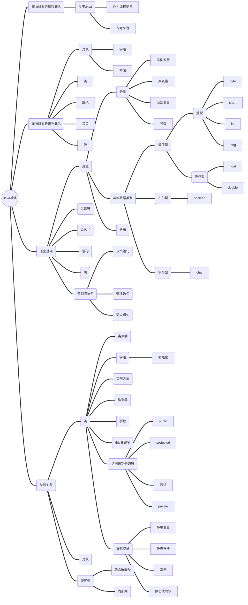

# 概述



# Java简介

## 关于Java

### 作为编程语言

.Java源代码文件通过编译器编译成.class字节码文件。Java虚拟机识别并运行.class文件


### 作为平台

平台是程序运行的硬件或软件环境

`Java平台两大组件：`

- Java虚拟机
- Java应用程序接口（API）

# 面向对象的编程概念

## 对象

`两大属性：`

- 字段：它处于什么状态
- 方法：他会发生什么行为

`方法`对对象内部 `字段`进行操作，是对象之间通讯的基本机制。这种隐藏对象内部 `状态`（字段），要求 所有通讯都通过对象 `方法`实现的行为，是面向对象编程的基本原则，称为 `数据封装`

将代码构建成独立软件对象的优点：

- 模块化
- 信息隐蔽
- 代码重用
- 可插拔易于调试

## 类

`类`是创建 `对象`的蓝图，`对象`是 `类`的实例。

`类`中不需要有main方法，因为类并不是一个完整的 `应用程序`。仅仅是程序可能用到的蓝图。

## 继承

`类`可以 `继承`其它类的状态（字段）和行为（方法）

每个类只能有一个 `直接的父类`。子类将会拥有父类的 `字段`和 `方法`

格式为关键字extends+要继承的类名，如下：

```java
class MountainBike extends Bicycle {

}
```

## 接口

对象通过 `方法`与外界沟通，也就是说，`方法`是对象与外界的 `接口`。

`接口`被定义为一组 `方法体为空`的相关方法的集合。

## 包

包是类和接口的 `命名空间`。

# 语言基础

## 变量

变量分类：

- `实例变量`：`非静态字段`。对于每个实例（对象）而言，他们都是唯一的
- `类变量`：`静态字段`。static修饰符声明的字段。不管被实例化多少次，类变量都不会改变。此外，也可以添加关键字final表示永远不会改变。
- `局部变量`：`方法中的临时状态`称为局部变量。局部变量只在方法体中有效。
- `参数`：方法的参数。

### 变量命名

- 区分大小写
- 字母开头
- 不支持空格
- 不能是关键字或保留字
- 驼峰命名法sss
- 如果是常量值，每个字符都大写，下划线分隔。`static final int NUM_GEARS=6`

### 基本数据类型

Java是静态类型的程序语言，所有的变量在使用前都必须先声明类型和名称。

Java有 `8种`基本数据类型

| 名称    | 类型                           | 长度 | 最小值      | 最大值       | 默认值(`只有字段有默认值`) |
| ------- | ------------------------------ | ---- | ----------- | ------------ | ---------------------------- |
| byte    | 整数                           | 8    | -128        | 127          | 0                            |
| short   | 整数                           | 16   | -32768      | 32767        | 0                            |
| int     | 整数                           | 32   | $-2^{31}$ | $2^{31}-1$ | 0                            |
| long    | 整数                           | 64   | $-2^{63}$ | $2^{63}-1$ | 0L                           |
| float   | 单精度**IEEE 754**浮点数 | 32   | -           | -            | 0.0f                         |
| double  | 双精度**IEEE 754**浮点数 | 64   | -           | -            | 0.0d                         |
| boolean | 布尔值                         | 1    | -           | -            | false                        |
| char    | 字符                           | 16   | \u0000      | \uffff       | null                         |

- `字面量`（literal）:基本数据类型创建时不需要 `new`，基本类型是 `内嵌在Java语言中`的特殊数据类型。`字`是用源代码表示的固定值。字不需要计算，直接由代码表示。
  - 整型字面量
    - `26L` 表示long类型
    - `26` 十进制int类型
    - `0x1a` 十六进制int类型
    - `0b11010` 二进制int类型
    - `1234_5678_9012` 可以在数字之间增加下划线增加可读性
  - 浮点字面量
    - `123.4` 不加任何后缀 `默认`表示double类型
    - `123.4d` double类型
    - `1.234e2` 科学计数标记
    - `123.4f` float类型
  - 类字面量:`类.class`,表示类型本身的对象
    - String.class
  - 字符字面量和字符串字面量
  - null

### 数组

数组是 `固定数目`的 `单一数据类型`的容器对象。


数组中每个项都称为 `元素`（element）。每个元素都用数字 `索引`(index)访问，索引从0开始。

#### 数组声明

告诉编译器该变量可以用于保存特定类型的数组：

```java
class Demo {
    //数组声明
    int[] anArray;
}
```

#### 创建数组

分配一定数量特定类型的内存空间的数组，并将该数组赋值给变量：

```java
class Demo {
    //创建数组
    int[] anArray = new int[10];
    //快捷方式定义数组
    int[] anArray = {
            100, 200, 300,
            400, 500, 600
    };
}
```

#### 数组赋值

```java
class Demo {
    int[] anArray = new int[10];

    public static void main(String[] args) {
        //数组赋值
        anArray[0] = 100;
    }
}
```

#### 访问元素

通过数字索引

```java
class Demo {
    int[] anArray = new int[10];

    public static void main(String[] args) {
        anArray[0] = 100;
        //访问数组
        System.out.println(anArray[0]);
    }
}
```

#### 数组的长度

```java
class Demo {
    int[] anArray = new int[10];

    public static void main(String[] args) {
        //数组长度
        anArray.length;
    }
}
```

#### 多维数组

```java
class MultiDimArrayDemo {
    public static void main(String[] args) {
        String[][] names = {
                {"Mr. ", "Mrs. ", "Ms. "},
                {"Smith", "Jones"}
        };
        // Mr. Smith
        System.out.println(names[0][0] + names[1][0]);
        // Ms. Jones
        System.out.println(names[0][2] + names[1][1]);
    }
}
```

#### 数组复制

System类有 `arraycopy`方法，用于数组之间数据的高效复制：

```java
class ArrayCopyDemo {
    public static void main(String[] args) {
        String[] copyFrom = {
                "Affogato", "Americano", "Cappuccino", "Corretto", "Cortado",
                "Doppio", "Espresso", "Frappucino", "Freddo", "Lungo", "Macchiato",
                "Marocchino", "Ristretto"};

        String[] copyTo = new String[7];
        System.arraycopy(copyFrom, 2, copyTo, 0, 7);
        for (String coffee : copyTo) {
            System.out.print(coffee + " ");
        }
    }
}
```

执行结果：

```text
Cappuccino Corretto Cortado Doppio Espresso Frappucino Freddo 
```

#### Arrays类

`java.util.Arrays`提供了一些数组操作方法。

- `copyOfRange()`: 数组复制
- `binarySearch()`: 搜索特定值，返回索引
- `equals()`: 两数组是否相等
- `fill()`: 在数组的每个索引位置填上指定值
- `sort()`: 升序排序-顺序方法
- `parallelSort()`: 升序排序-并发方法

```java
class ArraysDemo {
    public static void main(String[] args) {
        String[] copyFrom1 = {
                "Affogato", "Americano", "Cappuccino", "Corretto", "Cortado",
                "Doppio", "Espresso", "Frappucino", "Freddo", "Lungo"};
        String[] copyForm2 = {
                "Marocchino", "Ristretto"
        };

        //查找
        System.out.println(Arrays.binarySearch(copyFrom1, "Cortado"));
        //复制
        String[] copyTo = Arrays.copyOfRange(copyFrom1, 2, 9);
        System.out.println(Arrays.toString(copyTo));
        //比较
        System.out.println(Arrays.equals(copyFrom1, copyForm2));
        // 在每个索引位置填上指定值
        Arrays.fill(copyTo, "Cortado");
        System.out.println(Arrays.toString(copyTo));
        //升序排序之顺序排序：
        int[] ints1 = {3, 5, 1, 2};
        Arrays.sort(ints1);
        System.out.println(Arrays.toString(ints1));
        //升序排序之
        int[] ints2 = {30, 50, 10, 20};
        Arrays.parallelSort(ints2);
        System.out.println(Arrays.toString(ints2));
    }
}
```

## 运算符

运算符优先级：

| 运算符     | 优先级                                  |
| ---------- | --------------------------------------- |
| 后缀       | 表达式++  表达式--                     |
| 一元运算符 | ++表达式  --表达式  +表达式  -表达式 |
| 乘法       | * / %                                   |
| 加法       | + -                                     |
| 移位       | << >> >>>                               |
| 关系       | < > <= >= instanceof                    |
| 等式       | == !=                                   |
| 按位与     | &                                       |
| 按位异或   | ^                                       |
| 按位或     | \|                                      |
| 逻辑与     | &&                                      |
| 逻辑或     | \|\|                                    |
| 三元运算符 | ? :                                     |
| 赋值       | = += -= *= /= %= &= ^=                  |

## 表达式

`表达式`是由变量、运算符和方法调用等组成的构造。

`表达式`的计算结果为单个值

## 语句

`语句`构成了完整的执行单元

- 表达式语句
  - 赋值表达式;
  - 递增或递减表达式;
  - 方法调用;
  - 对象创建表达式;
- 声明语句
- [控制流语句](#控制流语句)

## 块

`块（代码块）`是一对花括号之间的一组语句

## 控制流语句

`控制流语句`通过 `决策`、`循环`和 `分支`使程序可以有条件的执行特定代码块

`决策语句：`

- if-then
- if-then-else
- switch

`循环语句：`

- for
- while
- do-while

`分支语句：`

- break
- continue
- return

# 类和对象

## 类

### 声明类

`类的声明包括以下部分：`

- 修饰符：public、private等
- 类名
- 如果有父类，使用extends继承超类
- 如果实现一系列接口（用逗号分隔），使用implements实现接口
- 类体

```java
class MyClass {
    // field, constructor, and 
    // method declarations
}
```

```java
//添加父类和实现接口
class MyClass extends MySuperClass implements YourInterface {
    // field, constructor, and
    // method declarations
}
```

### 字段

类中的成员变量通常称为 `字段`。

`字段声明包括以下部分：`

- 修饰符：基于 `封装`的精髓，一般字段设置为private
- 字段类型
- 字段名

#### 初始化

- 不进行初始化，字段会有[默认初始化](#基本数据类型)

- 直接初始化：直接在字段声明时进行初始化，但不能进行逻辑判断

- 在构造器中进行初始化

- 使用初始化块初始化字段

```java
class Demo {
    {
    // whatever code is needed for initialization goes here
    }
}
```

Java编译器会将初始化块复制到每个构造器，这样可以使多个构造器共享代码块

- 使用final方法初始化实例变量（`子类不能覆盖final方法`）

```java
class Whatever {
    private varType myVar = initializeInstanceVariable();
        
    protected final varType initializeInstanceVariable() {

        // initialization code goes here
    }
}
```


### 实例方法

`方法包含以下部分：`

- 修饰符
- 返回类型
- 方法名
- 圆括号内的参数列表
- 异常列表
- 花括号内的方法体

`方法签名`=方法名+参数列表

```java
//示例
class MyClass extends MySuperClass implements YourInterface {
    // field, constructor, and
    // method declarations
}
```

### 构建构造器

`构造器`与方法声明相似，只是 `构造器`名称与类名一样，且没有返回值。

如果一个类没有构造器，会自动构建一个 `无参默认构造器`，该 `无参默认构造器`会调用 `父类的`无参构造器。

如果一个类有构造器，则不会构建 `无参默认构造器`

如果一个类定义了有参构造器，没有无参构造器。他的子类如果是无参构造器。`编译会报错`。

```java
class Bicycle {
    public int cadence;
    public int gear;
    public int speed;

    //构造方法
    public Bicycle(int startCadence, int startSpeed, int startGear) {
        gear = startGear;
        cadence = startCadence;
        speed = startSpeed;
    }
}
```

### 参数

#### 形式参数

方法或构造的参数可以是任意数据类型

#### 可变参数

向方法传递 `任意数`目的值

可变参数和数组很相似，但也有区别：

- `可变参数`可以传入 `数组`，`数组`形参不可以传入 `可变参数`
- 如果一个方法有多个参数，`可变参数`应放到最后。

```java

//可变参数兼容数组
public class TestVarArgus {
    public static void dealArray(int... intArray) {
        for (int i : intArray)
            System.out.print(i + " ");

        System.out.println();
    }

    public static void main(String args[]) {
        int[] intArray = {1, 2, 3};

        dealArray(intArray);// 通过编译，正常运行

    }
}

//数组不兼容可变参数
public class TestVarArgus {
    public static void dealArray(int[] intArray) {
        for (int i : intArray)
            System.out.print(i + " ");

        System.out.println();
    }

    public static void main(String args[]) {
        dealArray(1, 2, 3);// 编译错误
    }
}
```

#### 参数名

- 形参名在作用域内必须唯一
- 形参名如果和字段名重复，会覆盖字段

#### 基本数据类型传参

传参方式：`传值方式`，传的是具体数值

`方法内对参数的任何改变，不会影响外部传入的变量`

```java
class Demo {
    public static void main(String[] args) {
        int num = 0;
        change(num);
        System.out.println(num);//输出0
    }

    public static void change(int numChange) {
        numChange = 5;
    }
}
```

输出结果：

```text
0
```

图示：


#### 引用数据类型传参

传参方式：`传值方式`，传的是引用

`方法内对参数的任何改变，会影响外部传入的变量`

```java
class Person {
    private String name;

    public Person(String name) {
        this.name = name;
    }

    public String getName() {
        return name;
    }

    public void setName(String name) {
        this.name = name;
    }

    @Override
    public String toString() {
        return "Person{" +
                "name='" + name + '\'' +
                '}';
    }
}

class Demo{
    public static void main(String[] args) {
        Person person = new Person("aaa");
        change(person);
        System.out.println(person);//输出 ccc 11
    }

    public static void change(Person personChange){
        personChange.setName("ccc");
        personChange = new Person("bbb");
    }
}
```

输出结果：

```text
Person{name='ccc'}
```

图示：


### this关键字

`this关键字`是当前对象的引用，在 `方法`或 `构造器`内部，可以使用this访问当前对象的所有成员。

```java
public class Point {
    public int x = 0;
    public int y = 0;
      
    //constructor
    public Point(int x, int y) {
        this.x = x;
        this.y = y;
    }
}
```

`显示构造器调用:`构造器内部使用this可以调用同一个类的其他构造器

```java
public class Rectangle {
    private int x, y;
    private int width, height;
      
    public Rectangle() {
        this(0, 0, 1, 1);
    }
    public Rectangle(int width, int height) {
        this(0, 0, width, height);
    }
    public Rectangle(int x, int y, int width, int height) {
        this.x = x;
        this.y = y;
        this.width = width;
        this.height = height;
    }
}
```

### 访问级别修饰符

- 顶级修饰符：修饰类或接口
  - `public`：对于其它类可见
  - `默认`（包级修饰符，无显示修饰符）：只有同一个包内的类可见
- 成员级：修饰类
  - public
  - protected
  - `默认`（包级修饰符，无显示修饰符）
  - private

成员级修饰符访问级别：

| 修饰符    | 类 | 包 | 子类 | 所有环境 |
| --------- | -- | -- | ---- | -------- |
| public    | Y  | Y  | Y    | Y        |
| protected | Y  | Y  | Y    | N        |
| 默认      | Y  | Y  | N    | N        |
| private   | Y  | N  | N    | N        |

对各自的成员使用最为严格的访问级别。除非有足够理由，否则都用`private`

除了常量，尽量避免public`字段`，使用public字段容易导致实现特殊化，并限制代码的灵活性。

### 静态成员

`static`修饰的字段和方法，属于`类`而不属于`类的实例`。

#### 类变量（静态字段）

声明中有static修饰符的字段称为`静态字段`或`类变量`。他们与类关联，而不与对象关联。

任何对象都能改变`静态字段`的值,即使不创建对象，也能处理这些`静态字段`

#### 类方法

用static修饰的方法成为`静态方法`

实例方法可以访问：
- 实例变量
- 类变量
- 实例方法
- 类方法
- this

类方法可以访问：
- 类变量
- 类方法

#### 常量

联合使用`static`和`final`修饰符可以定义常量。

- 常量不能重新赋值
- 常量名都是大写字母，多个单词用下划线分隔


```java
class Demo {
    static final double PI = 3.141592653589793;
}
```

#### 静态代码块

以static关键字开头，写在花括号中的普通代码。

```java
class Demo {
  static {
    // whatever code is needed for initialization goes here
  }
}
```

## 对象

`对象`通过调用 `方法`来交互，通过对象间的交互，程序可以执行不同的任务。

[类](#类-1)为对象创建提供了一个实现框架,可以从类创建对象

创建对象包含以下部分：

- 声明：将变量关联到对象类型上
- 实例化：new关键字是一个Java运算符，用于初始化对象。`new返回对象的引用,而不是对象本身。`
- 初始化：new运算符后跟一个构造器调用（用于初始化新对象）

## 嵌套类

在类内定义另一个类。

```java
class OuterClass {
  //内部类
  class InnerClass {
        
  }
  //静态嵌套类
  static class StaticNestedClass {
      
  }
}
```

为什么使用嵌套类：
- `对单一用途的类进行逻辑分类：`如果类只对其它一个类有用，就可以将前者逻辑嵌入到后者，将他们放在一起。嵌套这样的`帮助类`有助于保持包的`线性结构`。
- `提高封装度：`假设两个类A和B，B要访问A的私有成员。将B嵌入到A中，A的成员可用private修饰，而B可以访问这些成员。另外B对外界是隐藏的。
- `提高代码可读性和可维护性：`可以就近放置待用代码

### 静态嵌套类

性质跟[类方法](#类方法)相似，不能直接访问外部类的其它成员

创建静态嵌套类对象:

```java
class OuterClass {
    static class StaticNestedClass {
        
    }
}

class Demo {
  public static void main(String[] args) {
    OuterClass.StaticNestedClass nestedObject = new OuterClass.StaticNestedClass();
  }
}
```

### 内部类

性质跟[实例方法](#实例方法)相似。可以访问外部类的其它成员，即使它被声明为private

内部不能定义`静态成员`

强烈反对对内部类进行序列化处理

创建内部类对象

```java
class OuterClass {

  class InnerClass {

  }
}

class Demo {
  public static void main(String[] args) {
    //需要先创建外部类对象
    OuterClass outerClass = new OuterClass();
    //创建内部类对象
    OuterClass.InnerClass innerClass = outerClass.new InnerClass();
  }
}
```

#### 局部类

局部类可以在任意`块`中定义，通常局部类定义在`方法体`中。

**访问范围**：

- 局部类可以访问所属类的成员

- 局部类可以访问所属块`final修饰`的局部变量。`Java SE 8`之后，局部变量可以访问`不被final修饰`的局部变量，但该局部变量一旦声明初始化后，就不能再修改了，称为`有效final`。(`只读`)

- Java1.8之后可以访问所属方法的参数。访问后参数也必须是`有效final`，不可以修改。(`只读`)

`分析一下为什么局部类访问所属块的局部变量时，局部变量需要是final的：`

`局部变量`是跟着方法走的，在`栈内存`当中。而局部类是new出来的，会在堆中持续存在直至垃圾回收。
